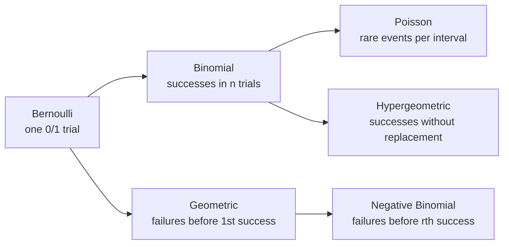

# Random Variables & Distributions

Once outcomes become numbers, probability gains its full arithmetic: expectation, variance, and a family
of named distributions that recur everywhere in machine learning. This section introduces random variables,
builds the discrete family from a single idea, then makes the leap to continuous variables with densities,
LOTUS, and the uniform distribution.

!!! tip "Rapid Recall"
    A random variable is a function from outcomes to numbers, and the event $X=x$ is secretly the set of
    outcomes mapping to $x$. The discrete family is one idea split by what you fix and what you count:
    Bernoulli is the atom, the binomial counts successes in $n$ fixed trials, the hypergeometric counts
    without replacement, the geometric and negative binomial count failures before successes, and the Poisson
    counts rare events per interval with mean equal to variance. The PMF gives probability mass; the CDF
    accumulates it. Expectation is a probability-weighted average and is linear regardless of dependence.
    Continuous variables swap sums for integrals and the PMF for a density, where probability is area not
    height, and variance is $E[X^2]-(E[X])^2$ with LOTUS as the engine behind every moment.

## What this section covers

- [Random Variables & Discrete Families](random-variables.md): random variables and processes, Bernoulli, binomial, the PMF, indicator variables, and the hypergeometric distribution.
- [CDF, Expectation & Variance](cdf-expectation-variance.md): the cumulative distribution function, expected value and linearity, and variance with standard deviation.
- [More Discrete Distributions](discrete-families.md): geometric, negative binomial, Poisson, the binomial-to-Poisson limit, and three famous worked examples.
- [Continuous Random Variables](continuous.md): the PDF, continuous expectation, the uniform distribution, LOTUS, and the master cheat sheet.

## The discrete family is one idea

