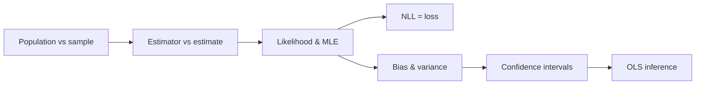

# Estimation & Inference

Inferential statistics turns probability into a method: we care about a population we cannot fully observe,
so we measure a sample and reason backward. This section builds the chain from population and sample, through
likelihood and maximum likelihood estimation, to bias, confidence intervals, and ordinary least squares.

!!! tip "Rapid Recall"
    The core tension: the parameter we want is fixed but unknown, the statistic we have is known but random,
    and estimation bridges them via the sampling distribution (CLT and LLN). An estimator is a rule (a random
    variable with properties); an estimate is the number it produces. Likelihood reads the model formula
    backward, fixing data and varying the parameter, and maximum likelihood picks the parameter making the
    data most probable, which becomes the loss (Gaussian targets give MSE, categorical give cross-entropy).
    Unbiasedness asks whether the estimator is centered on the truth; confidence intervals wrap an estimate in
    an honest range whose reliability is a property of the procedure. OLS is Gaussian-noise MLE and is BLUE.

## What this section covers

- [Population, Samples & Estimators](population-estimators.md): the parameter-versus-statistic vocabulary and the estimator-versus-estimate distinction.
- [Likelihood & MLE](likelihood-mle.md): probability versus likelihood, why we maximize likelihood, the log trick, the loss connection, and worked MLE problems.
- [Bias & Unbiased Estimators](bias.md): what unbiasedness means, the $n-1$ variance correction, and the bias-variance view.
- [Confidence Intervals](confidence-intervals.md): the z and t intervals, variance and proportion intervals, and the four estimation cases.
- [OLS as Inference](ols-inference.md): least squares as maximum likelihood, Gauss-Markov, and regression confidence intervals.

## The reasoning chain

