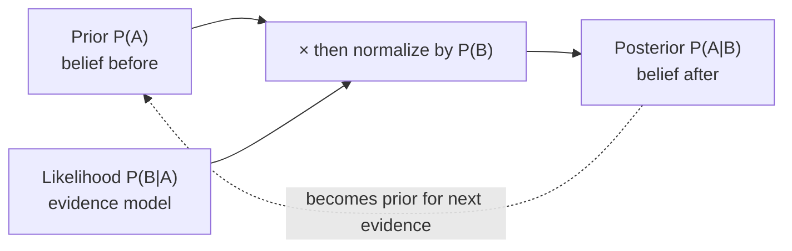

# Bayes' Theorem

Bayes' theorem is the rule for flipping a conditional probability from the direction you know to the
direction you want. It is one line of algebra, yet it underwrites disease screening, spam filters, and the
entire vocabulary of Bayesian machine learning. This page derives it, names its parts, works the three
canonical problems, and closes with the subtle topic of conditional independence.

!!! tip "Rapid Recall"
    Bayes' theorem, $P(A\mid B)=P(B\mid A)P(A)/P(B)$, is the multiplication rule solved for the other
    direction: you usually know $P(B\mid A)$ but want $P(A\mid B)$. The vocabulary is prior, likelihood,
    posterior, and evidence, with posterior proportional to likelihood times prior. Base rates dominate: on a
    rare condition even a 95 percent accurate test yields mostly false positives, so the posterior of disease
    given a positive can be near 16 percent. What you condition on matters: a specific ace shrinks the world
    more than "some ace." Conditional independence ($P(A\cap B\mid C)=P(A\mid C)P(B\mid C)$) neither implies
    nor is implied by ordinary independence, and conditioning can both create and destroy dependence.

## §9 Bayes' Theorem

**Derivation, one line.** The multiplication rule gives two expressions for $P(A\cap B)$:
$P(A)P(B\mid A)$ and $P(B)P(A\mid B)$. Set them equal and divide by $P(B)$. Bayes is just the multiplication
rule solved for the other direction.

$$P(A\mid B)=\frac{P(B\mid A)\,P(A)}{P(B)}$$

**Why it is profound, the flip.** You often know $P(B\mid A)$ but want $P(A\mid B)$. You know
$P(\text{positive test}\mid\text{disease})$ (the test's lab-measured accuracy), but you want
$P(\text{disease}\mid\text{positive test})$ (do I actually have it?). Bayes flips the one you have into the
one you want.

**Vocabulary, the language of Bayesian ML:**

- $P(A)$, the **prior**: belief before evidence.
- $P(B\mid A)$, the **likelihood**: how probable the evidence is if $A$ were true.
- $P(A\mid B)$, the **posterior**: updated belief after evidence.
- $P(B)$, the **evidence** or **marginal**: overall probability of the evidence (the normalizer, via total probability).

In words: **posterior is proportional to likelihood times prior.**

### Worked problem: aces given at least one ace

!!! note "Question"
    A random 2-card hand from 52 cards. Given you have **at least one ace**, what is $P(\text{both aces})$?

$P(\text{both}\mid\text{at least one})=\dfrac{P(\text{both})}{P(\text{at least one})}$ (since "both aces"
implies "at least one ace," the intersection collapses to "both").

- Numerator: $P(\text{both})=\dfrac{\binom{4}{2}}{\binom{52}{2}}=\dfrac{6}{1326}$.
- Denominator: $P(\text{at least one})=1-\dfrac{\binom{48}{2}}{\binom{52}{2}}=1-\dfrac{1128}{1326}=\dfrac{198}{1326}$.

$$P=\frac{6/1326}{198/1326}=\frac{6}{198}=\frac{1}{33}$$

**Answer:** $\tfrac{1}{33}$.

### Worked problem: aces given the ace of spades

!!! note "Question"
    Same 2-card hand. Now you are told you hold the **ace of spades** specifically. $P(\text{both aces})$?

One card is pinned (ace of spades). For both to be aces, the other card must be one of the 3 remaining aces
out of the 51 unknown cards:

$$P=\frac{3}{51}=\frac{1}{17}$$

**Answer:** $\tfrac{1}{17}$, nearly double the previous answer.

> **Key takeaway.** $\tfrac{1}{17}\neq\tfrac{1}{33}$: naming a *specific* ace shrinks your world more
> aggressively than "some ace," ruling out the many one-ace hands that do not contain the spade. **What
> exactly you condition on matters enormously.**

### Worked problem: the disease test (canonical Bayes)

!!! note "Question"
    1% of patients have a disease. A test is 95% accurate (correct positive if sick, correct negative if
    healthy). You test **positive**. What is $P(\text{disease})$?

$D$ = has disease, $T$ = tests positive. Given: $P(D)=0.01$, $P(T\mid D)=0.95$, $P(T\mid D^{c})=0.05$. Want
$P(D\mid T)$.

- Numerator: $P(T\mid D)P(D)=0.95\times 0.01=0.0095$.
- Denominator via **total probability** (a positive can come from sick OR healthy):

$$P(T)=P(T\mid D)P(D)+P(T\mid D^{c})P(D^{c})=0.0095+(0.05)(0.99)=0.059$$

- Combine:

$$P(D\mid T)=\frac{0.0095}{0.059}\approx 0.16$$

**Answer:** only about $16\%$, despite a positive on a "95% accurate" test.

> **Key takeaway.** **Base rates dominate.** The disease is rare (1%), so false positives from the huge
> healthy group ($0.05\times 0.99=0.0495$) swamp the true positives from the tiny sick group ($0.0095$). When
> a condition is rare, even an accurate test produces mostly false positives. Ignoring the prior is one of the
> most expensive reasoning errors there is.

## §10 Conditional Independence

$A$ and $B$ are **conditionally independent given $C$** if

$$P(A\cap B\mid C)=P(A\mid C)\,P(B\mid C)$$

Once you know $C$, learning $A$ tells you nothing more about $B$.

**The crucial part:** conditional independence and ordinary independence are *not* the same; neither implies
the other. Both directions happen:

**Example A, dependent normally, independent once you condition (chess opponent).** You play repeated games
versus an opponent of *unknown* strength. **Without** knowing strength: dependent, since crushing wins in
early games are evidence they are strong, lowering your odds later. Information leaks through the hidden
strength. **Given** their true strength $C$: conditionally independent, since you already know the thing the
games were hinting at, so past games tell you nothing new. *Dependent unconditionally, independent given C.*

**Example B, independent normally, dependent once you condition (fire alarm).** An alarm ($A$) has two
independent possible causes: fire ($F$) or popcorn ($C$). Normally fire and popcorn are unrelated. But
**given the alarm went off**, if you learn it was *not* popcorn, the probability it was fire jumps to 1,
since something set it off:

$$P(F\mid A\cap C^{c})=1$$

*Independent unconditionally, dependent given C.* This is "explaining away": two independent causes of a
common effect become coupled once you observe the effect.

> **Key takeaway.** Conditional independence is the foundation of **Naive Bayes** (assumes features
> independent given the label) and **Bayesian networks** and **graphical models** (whose structure *is* a map
> of conditional independences). Conditioning can both create and destroy dependence, and understanding that
> separates people who get these models from people who memorized formulas.

## Interview Questions

**Q1: Derive Bayes' theorem from the multiplication rule.**
The multiplication rule writes the joint two ways, $P(A\cap B)=P(A)P(B\mid A)=P(B)P(A\mid B)$. Equate the
right-hand sides and divide by $P(B)$ to get $P(A\mid B)=P(B\mid A)P(A)/P(B)$. Bayes is simply the
multiplication rule solved for the opposite conditioning direction.

**Q2: A test is 95% accurate for a disease with 1% prevalence. You test positive. Roughly what is the chance you are sick?**
About 16 percent. The true positives are $0.95\times 0.01 = 0.0095$, but the false positives are
$0.05\times 0.99 = 0.0495$, and the posterior is $0.0095/(0.0095+0.0495)\approx 0.16$. The rare base rate
means false positives from the large healthy group dominate, so a positive result on an accurate test is
still probably wrong.

**Q3: Why does "given the ace of spades" give a higher probability of two aces than "given at least one ace"?**
Naming a specific card conditions on a smaller, more informative world. "At least one ace" includes many
hands with a single non-spade ace, which drag the probability of two aces down to $1/33$. Pinning the ace of
spades removes all hands that do not contain it, leaving the other card as one of 3 aces among 51 unknowns,
which gives $1/17$. What you condition on changes the answer.

**Q4: Give an example where conditioning destroys independence.**
The fire alarm. Fire and popcorn are independent causes of an alarm, but once the alarm sounds, learning it
was not popcorn forces the probability of fire to one. Observing a common effect couples its otherwise
independent causes, an effect called explaining away, which is central to reasoning in Bayesian networks.
