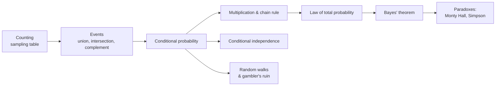

# Probability Foundations

Elementary probability before random variables enter the picture: how to count outcomes, how to reason
about events, how to update beliefs when evidence arrives, and the famous paradoxes that expose where
intuition fails. This is the bedrock the rest of the probability track stands on.

!!! tip "Rapid Recall"
    Almost all of elementary probability is counting: favorable outcomes over total outcomes. The sampling
    table answers "how many ways to pick $k$ from $n$" along two switches, order and replacement. Events
    combine through unions, intersections, and complements, and the complement flip turns "at least one"
    into "one minus none." Conditioning shrinks your world to the evidence, the multiplication and chain
    rules build joint events piece by piece, total probability assembles a marginal from cases, and Bayes
    flips a known direction into the one you want. The paradoxes all carry the same lesson: you cannot
    compute a probability without understanding the process that generated the data.

## What this section covers

- [Counting & the Sampling Table](counting.md): the four sampling regimes, Vandermonde's identity, and the inclusion-exclusion principle.
- [Events, Independence & Conditioning](events-conditioning.md): translating English into set language, independence, conditional probability, the multiplication and chain rules, and the law of total probability.
- [Bayes' Theorem](bayes.md): the flip, the Bayesian vocabulary, three canonical worked problems, and conditional independence.
- [Paradoxes & Random Walks](paradoxes-walks.md): Monty Hall, Simpson's paradox, gambler's ruin, and Polya's recurrence across dimensions.

## How the ideas connect

