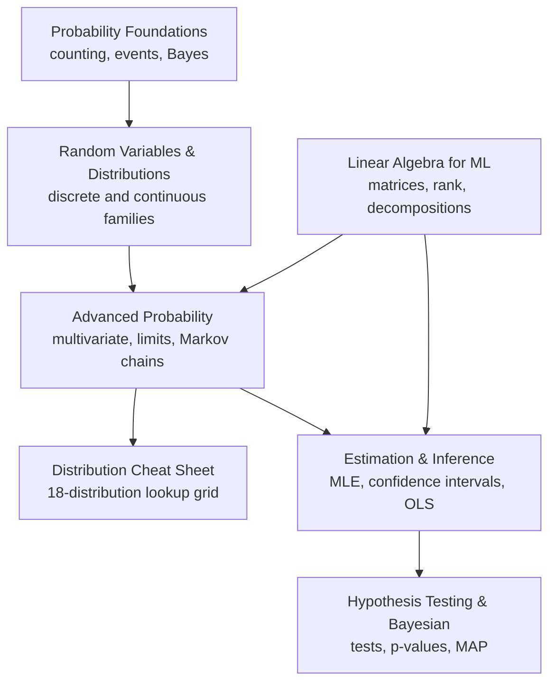

# Mathematics Study Notes

A single, navigable reference for the mathematics behind machine learning interviews: probability,
inferential statistics, and linear algebra. Every page leads with intuition, keeps the formalism right
beside it, and ends with the interview questions that topic tends to attract. Read a track in order, or
jump straight to the page you need ten minutes before a screen.

!!! abstract "How this site is organized"
    Three tracks, seven sections. The **probability track** moves from counting and conditioning, through
    random variables and distributions, into advanced probability theory, with a standalone distribution
    cheat sheet. The **inference track** turns probability into estimators, intervals, and tests. The
    **linear algebra track** is the computational language underneath regression, covariance, PCA, and
    optimization. Use the tabs at the top, or the map below.

## The section graph

The arrows show prerequisites: follow them forward and nothing on a later page will surprise you.

## Reading paths

- **Probability path:** [Foundations](foundations/index.md) then [Random Variables & Distributions](distributions/index.md) then [Advanced Probability](advanced/index.md) then the [Distribution Cheat Sheet](cheatsheet/index.md).
- **Inference path:** [Estimation & Inference](estimation/index.md) then [Hypothesis Testing & Bayesian Inference](testing/index.md). This path leans on the probability sequence, especially distributions, the law of large numbers, the central limit theorem, and likelihood.
- **Linear algebra support path:** read [Linear Algebra for ML](linear-algebra/index.md) in parallel with inference and ML topics. It supports ordinary least squares, principal component analysis, covariance, Markov matrices, optimization, pseudo-inverses, and the singular value decomposition.

## The seven sections

| Section | What it builds | Start here |
|---|---|---|
| Probability Foundations | Counting, conditioning, Bayes, paradoxes, random walks | [Open](foundations/index.md) |
| Random Variables & Distributions | Discrete and continuous families, expectation, variance | [Open](distributions/index.md) |
| Advanced Probability | Normal theory, moment-generating functions, covariance, limits, Markov chains | [Open](advanced/index.md) |
| Distribution Cheat Sheet | Side-by-side lookup of eighteen distributions | [Open](cheatsheet/index.md) |
| Estimation & Inference | Likelihood, maximum likelihood estimation, bias, confidence intervals, ordinary least squares | [Open](estimation/index.md) |
| Hypothesis Testing & Bayesian Inference | Tests, p-values, errors, power, Bayesian estimation | [Open](testing/index.md) |
| Linear Algebra for ML | Matrices, rank, definiteness, decompositions, matrix calculus | [Open](linear-algebra/index.md) |
