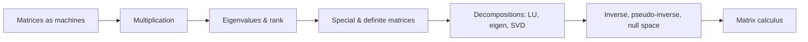

# Linear Algebra for ML

Linear algebra is the computational language under machine learning: matrices are machines that transform
vectors, and almost every model is a chain of such machines. This section runs from matrices-as-machines
through eigenvalues, rank, special matrices, the major decompositions, and the matrix calculus that powers
backpropagation.

!!! tip "Rapid Recall"
    A matrix is a linear machine, fully described by where it sends the basis vectors, which become its
    columns. Multiplication chains machines or runs one over a batch. Eigenvectors are the directions a matrix
    only scales, and rank counts its genuinely independent directions. Symmetric matrices factor into a rigid
    rotate-scale-rotate, and positive (semi)definite ones are the algebraic signature of a bowl, the language
    of convex optimization. The singular value decomposition unifies everything: every matrix is a rotation, a
    stretch, and a rotation, with stretches ordered so you can keep the big ones and discard the rest.
    Invertibility says a machine collapses nothing; the pseudo-inverse is what you reach for when it does.

## What this section covers

- [Matrices as Machines](matrices-machines.md): the machine view, shapes, columns as landing spots, and both multiplication pictures.
- [Eigenvalues, Pivots & Rank](eigen-rank.md): eigenvectors and eigenvalues, pivots, and rank with the low-rank outer product.
- [Special Matrices & Definiteness](special-definite.md): identity, singular, symmetric, orthogonal, projection, reflection, Markov, and positive (semi)definite matrices.
- [Decompositions (LU, Eigen, SVD)](decompositions.md): why decompose, LU, diagonalization, and the singular value decomposition.
- [Basis, Inverse & Matrix Calculus](basis-inverse-calculus.md): basis, invertibility, the pseudo-inverse, null space, and the matrix calculus cheat sheet.

## The single thread

