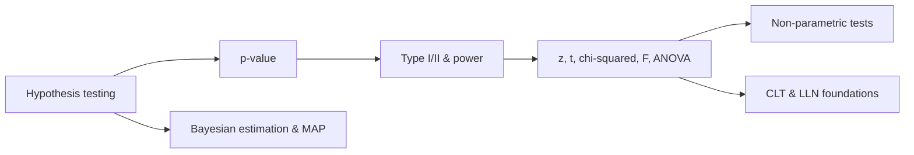

# Hypothesis Testing & Bayesian Inference

The decision side of inference: given noisy data, how do you separate real signal from random chance, and how
do you quantify the risk of being wrong? This section covers hypothesis testing and p-values, the two error
types and statistical power, the test family (z, t, chi-squared, F, ANOVA), non-parametric tests, Bayesian
estimation, and the practical concepts that surround them.

!!! tip "Rapid Recall"
    A hypothesis test asks whether an effect is real or luck, framing a specific null and rejecting it only
    when the data are surprising under it. The p-value is the probability of data this extreme or more given
    the null, not the probability the null is true. Type I error (false positive) has probability $\alpha$
    that you set; Type II ($\beta$) depends on effect size, sample size, noise, and $\alpha$, and power is
    $1-\beta$. The test family (z, t, chi-squared, F) all descend from the normal via the central limit
    theorem. Bayesian estimation reweights a prior by the likelihood, and MAP picks the posterior mode, which
    is exactly regularized maximum likelihood.

## What this section covers

- [Hypothesis Testing & p-values](hypothesis-pvalues.md): the framework, framing the null, and what a p-value really is.
- [Errors, FDR & Power](errors-power.md): Type I and II errors, the false discovery rate, precision and recall, and power analysis.
- [t, z, Chi-Squared & F Tests](t-z-chi-f.md): the distribution family and the tests built on each.
- [Variance Tests, ANOVA & Non-Parametric](variance-anova-nonparam.md): ANOVA, order statistics, Wilcoxon, and Kolmogorov-Smirnov.
- [Bayesian Estimation & MAP](bayesian-map.md): prior, likelihood, posterior, and maximum a posteriori as regularization.
- [Practical Concepts](practical-concepts.md): effective sample size, SD versus SE, bootstrapping, the $n-1$ proof, odds and log-odds, and the limit theorems in inference.

## The decision pipeline

