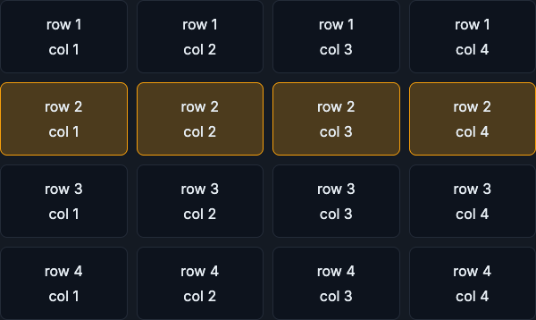
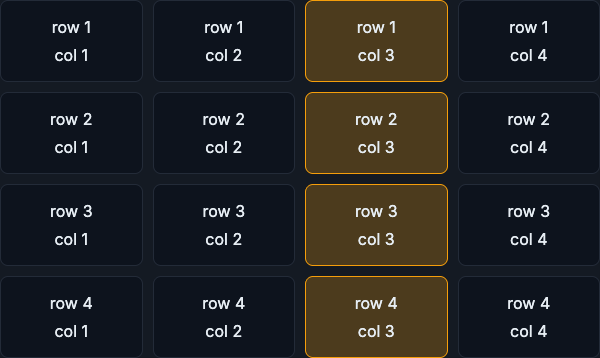

# Data Formats and Storage

A file format is not just a storage detail. It controls what is cheap to read, what is easy to debug, and how safely schemas evolve. The same is true one level up: different stores exist because different questions need different access patterns and consistency guarantees.

!!! tip "Rapid Recall"
    JSON is flexible and human-friendly but slow and wasteful for analytics; CSV is universal but weakly typed and fragile; Parquet is binary, columnar, and compressed, so a training job can read five columns out of three hundred and skip the rest. That columnar access pattern is exactly what ML training needs. One level up, OLTP runs the live product with many small indexed reads and writes, while OLAP analyzes history with fewer huge scans, and you should not run training scans directly on the checkout database. ACID protects transaction correctness for sources of truth; BASE trades strict consistency for availability and scale, which is fine only if you understand what stale data does to the model.

## §1 Data formats and physical layout

### JSON

JSON is easy for humans and APIs. A single event can carry flexible fields: device information, request headers, nested metadata, and optional attributes. That makes JSON good for raw logs and service payloads. The cost is that text parsing is slow, repeated field names waste space, and types can be ambiguous. The string "123" and the number 123 are different, and missing fields require careful handling.

### CSV

CSV is simple and universal. Almost every tool can open it. But CSV is weak for production data engineering: no rich schema, weak typing, awkward escaping, no nested structures, poor compression, and fragile handling of nulls. It is fine for small exports and examples; it is not ideal as the backbone of a large ML data platform.

### Parquet

Parquet is binary, columnar, compressed, and built for analytical workloads. If your training job needs five columns out of a table with 300 columns, Parquet readers can skip most irrelevant data. Parquet stores column chunks together, compresses similar values well, and records metadata that query engines can use to skip row groups.

Columnar storage is why Parquet is common for feature matrices and lakehouse tables. ML training often scans many rows and selected columns. That is exactly the access pattern Parquet optimizes. The tradeoff is that Parquet is not human-readable and is not ideal for tiny row-by-row writes. Usually, streaming or transactional systems collect events first, then batch or compact them into Parquet for analytics and training.

The contrast between fetching one full row and scanning one feature column is the whole intuition behind columnar storage:

<figure class="diagram diagram-dark" markdown="1">
  
  <figcaption>Row access touches every column of one record, which row-oriented formats favor.</figcaption>
</figure>

<figure class="diagram diagram-dark" markdown="1">
  
  <figcaption>Column access reads one feature across many rows, which Parquet makes cheap by skipping the rest.</figcaption>
</figure>

!!! note "Interview note"
    Data-science analogy: Parquet is the storage version of thinking in feature columns. If you only need `transaction_amount`, `country`, and `device_risk_score`, a columnar file avoids dragging unrelated fields through the pipeline.

## §2 Data models, OLTP/OLAP, ACID/BASE

An **OLTP** system runs the live product. It handles many small reads and writes: create user, update payment, fetch session, write order, check inventory. It optimizes low-latency indexed access and safe concurrent updates. Postgres, MySQL, DynamoDB, Spanner, and similar systems often play this role.

An **OLAP** system analyzes history. It handles fewer but much larger queries: compute daily revenue, build a training set, aggregate model performance by segment, scan billions of events. Warehouses and lakehouses are designed for this shape. Snowflake, BigQuery, Redshift, Databricks SQL, Trino, DuckDB, and Spark are common examples.

Do not run huge training-data scans directly on the checkout database. You may slow down real users. Instead, copy or stream operational data into analytical storage. That separation is one of the most important data-engineering ideas in ML systems.

### ACID and BASE in plain language

**ACID** means the database protects transaction correctness. If you transfer money, you do not want one account debited without the other credited. In ML systems, ACID matters for model registry transitions, feature definitions, metadata, payment events, and any source of truth.

**BASE** systems trade strict immediate consistency for availability and scale. A feed counter can be slightly stale. A telemetry event can arrive late. A feature value may be eventually updated. This can be fine, but you must understand what stale data does to the model.

### Choosing a store

| Need | Likely store | Why |
|---|---|---|
| Payment transaction | Relational/strong transactional DB | Correctness matters more than flexible scale. |
| Raw clickstream | Event log + object storage/lakehouse | Huge append volume, replay, historical scans. |
| Latest user features at serving | Key-value online store | Lookup by entity id with low p99 latency. |
| Training feature history | Warehouse/lakehouse | Columnar scans and point-in-time joins. |
| Embedding nearest neighbors | Vector index/store | Similarity search, not exact key lookup. |

## Interview Questions

**Q1: Why is Parquet preferred over CSV or JSON for ML training data?**
Parquet is binary, columnar, and compressed, so a training job that needs five columns out of three hundred can skip the rest and read row-group metadata to avoid irrelevant data. That matches ML training's access pattern of scanning many rows over selected columns. JSON is flexible but slow and type-ambiguous, and CSV is universal but weakly typed with poor compression and no nested structure.

**Q2: When is JSON still the right choice?**
For raw logs and service payloads, where a single event needs flexible, nested, optional fields like device information and request headers. JSON is human-readable and API-friendly, which is valuable at the ingestion edge. Systems typically collect JSON events first and then compact them into Parquet for analytics and training.

**Q3: What is the difference between OLTP and OLAP, and why keep them separate?**
OLTP runs the live product with many small low-latency indexed reads and writes; OLAP analyzes history with fewer but much larger scans. You separate them so heavy training-data scans do not slow down real checkout users; operational data is copied or streamed into analytical storage instead of scanned in place.

**Q4: When do you accept BASE over ACID?**
ACID is for sources of truth where correctness cannot bend: payments, model registry transitions, feature definitions, metadata. BASE trades strict immediate consistency for availability and scale, which is fine for a slightly stale feed counter, a late telemetry event, or an eventually-updated feature value, as long as you understand what that staleness does to the model.
