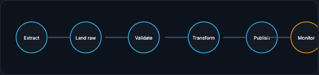

# Pipelines and the Lakehouse

A data pipeline is not a script. It is a repeatable, observable process that moves data from raw to trusted while handling failures. This page covers how data moves (ETL, ELT, batch, streaming, CDC), where it lands (lake, warehouse, lakehouse), how components hand it off, and how to synthesize all of it into a clean interview answer.

!!! tip "Rapid Recall"
    ETL transforms before loading; ELT lands raw then transforms in place, which cloud storage made cheap. Batch runs on bounded data and is easy to test and replay, so it suits training-set generation; streaming runs on unbounded events and is needed when features must be fresh; CDC publishes operational database changes as events instead of polling. A lake stores flexible raw files cheaply, a warehouse stores governed analytical tables, and a lakehouse combines cheap object storage with table formats (Iceberg, Delta, Hudi) for snapshots, schema evolution, and transactional writes. How components pass data (database, service call, queue, object storage, feature store, vector store) determines coupling, latency, durability, and debuggability. The strong answer starts with the decision moment, not the database name.

## §1 ETL, ELT, batch, streaming, and CDC

**ETL** means extract, transform, load. You pull data from sources, clean and shape it, then load it into the destination. **ELT** means extract, load, transform. You first land data in a warehouse or lakehouse, then transform it there. ELT became common because cloud storage is cheap and modern query engines can transform large data in place.

**Batch processing** runs on bounded data: the last hour, yesterday, last month, or a backfill range. It is easier to test and replay. Training data generation is often batch because you need a consistent historical snapshot.

**Stream processing** runs continuously on unbounded events. It is needed when features must be fresh: failed login count in the last 10 minutes, card velocity in the last hour, click count in the last 30 seconds. Streaming systems must handle late events, out-of-order events, state, windows, and replay.

**CDC**, change-data-capture, watches operational database changes and publishes them as events. Instead of querying the database every minute to see what changed, CDC emits inserts, updates, and deletes. This is useful for syncing product state into analytics, search indexes, feature pipelines, and caches.

A robust pipeline is a sequence of stages, each observable, that moves data from raw to published while monitoring quality:

<figure class="diagram diagram-dark" markdown="1">
  
  <figcaption>A pipeline is a repeatable, observable process: extract, land raw, validate, transform, publish, and monitor.</figcaption>
</figure>

!!! warning "Trap"
    Production failure modes: retries can duplicate records; backfills can overwrite good partitions; schema changes can break consumers; late events can change aggregates; and silent null explosions can poison training.

## §2 Data lake, warehouse, and lakehouse

A data lake stores flexible raw files. A warehouse stores governed analytical tables. A lakehouse tries to combine cheap flexible storage with warehouse-like table guarantees.

A traditional **data lake** is object storage: S3, GCS, ADLS, or MinIO. It can store JSON, CSV, Parquet, images, audio, logs, model artifacts, and anything else. It is cheap and flexible, but raw lakes can become messy: no clear schema, duplicate datasets, unclear ownership, and hard-to-trust tables.

A **data warehouse** gives structured tables, SQL, governance, performance, and business trust. It is excellent for BI and analytics. But warehouses can be expensive for raw data retention, less flexible for unstructured data, and tied to a particular engine.

A **lakehouse** uses object storage plus table formats such as Apache Iceberg, Delta Lake, or Apache Hudi. These formats track table metadata, snapshots, schema evolution, partitioning, and transactional writes. Catalogs such as Unity Catalog, AWS Glue, Apache Polaris, or Nessie provide permissions, discovery, and governance. Compute engines such as Spark, Trino, Flink, DuckDB, Snowflake, BigQuery, and Databricks can read the same table format.

For ML, the lakehouse is valuable because training needs large historical scans, reproducibility, schema evolution, and multiple compute engines. You might use Spark to build features, DuckDB for local debugging, Trino for ad hoc queries, and a training job reading the same Parquet-backed table.

!!! abstract "2026 practical reality"
    Lakehouse-style architecture is central to AI data platforms because raw events, curated features, labels, embeddings, evaluation outputs, and governance metadata can live in one coherent storage layer.

## §3 Passing data between components

How components pass data determines coupling, latency, durability, and debuggability.

**Database handoff:** one component writes a table; another reads it. This is durable and easy to inspect, but consumers become coupled to schema and polling can be inefficient.

**Service call:** one component calls another over REST or RPC. This is good when the caller needs an answer immediately. It is bad for high-volume event movement because it tightly couples availability and latency.

**Queue or pub-sub:** producers publish events; consumers process asynchronously. This decouples services and supports replay, but introduces ordering, retry, and lag questions.

**Object storage handoff:** batch jobs write files for other jobs. This is good for large data and model artifacts, but not for low-latency decisions.

**Feature store handoff:** training and serving share feature definitions while using different physical stores: offline for history, online for low-latency lookup.

**Vector store handoff:** embedding producers write vectors; retrieval systems perform nearest-neighbor search for recommendations, semantic search, RAG, or personalization.

## §4 Interview synthesis

A strong ML data answer starts with the decision moment, not the database name. If asked to design the data layer for a fraud model, say something like:

> "I would first define prediction time as payment submission and define the label as confirmed fraud or chargeback within a fixed future window. Then I would build point-in-time correct training examples: features computed only from events before payment time, labels from after payment time. Raw events would land in a lakehouse for historical training and replay. Fresh serving features such as failed-login velocity would come from a streaming pipeline into an online feature store. I would validate schema, freshness, null rates, distribution shifts, and leakage before training. I would not scan the OLTP checkout database directly for training workloads."

That answer shows conceptual understanding. It connects product timing, labels, features, storage, pipelines, and validation. It does not rely on name-dropping tools.

## Interview Questions

**Q1: What is the difference between ETL and ELT, and why did ELT become common?**
ETL transforms data before loading it into the destination; ELT lands raw data first and transforms it in place in the warehouse or lakehouse. ELT became common because cloud storage is cheap and modern query engines can transform large data where it sits, removing the need for a separate transform stage before loading.

**Q2: When do you need streaming instead of batch for features?**
When features must be fresh enough to react in near real time, such as failed login count in the last 10 minutes or card velocity in the last hour. Batch is fine for a consistent historical snapshot like training-set generation, but a daily job cannot supply a feature the model needs within seconds, and streaming must then handle late events, out-of-order events, windows, and replay.

**Q3: What does a lakehouse add over a plain data lake?**
Table formats such as Iceberg, Delta, or Hudi layered on object storage, giving snapshots, schema evolution, partitioning, and transactional writes, plus catalogs for permissions and discovery. That turns a cheap but messy raw lake into governed, reproducible tables that many engines (Spark, Trino, DuckDB, Snowflake) can read, which matches ML's need for large historical scans and reproducibility.

**Q4: How would you structure a strong answer to "design the data layer for a fraud model"?**
Start with the decision moment, not the database. Define prediction time as payment submission and the label as confirmed fraud within a fixed window, then build point-in-time correct rows. Land raw events in a lakehouse for training and replay, serve fresh features like login velocity from a streaming pipeline into an online feature store, validate schema, freshness, nulls, drift, and leakage before training, and never scan the OLTP checkout database for training workloads.
