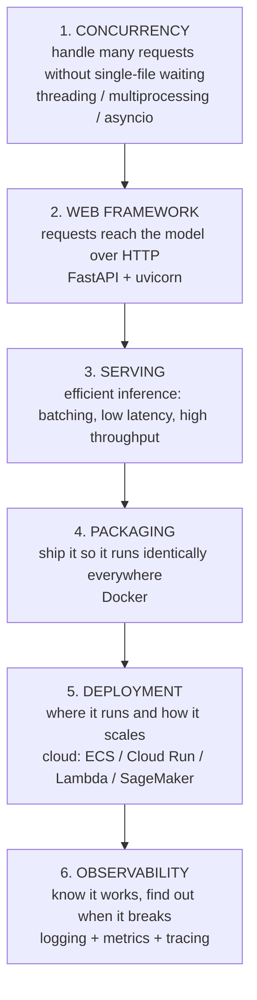

# Implementation Masterclass

The gap between "my model works in a notebook" and "my model serves 1000 requests/second reliably." This section covers the concepts and tooling that close that gap, the stuff that comes up when an interviewer asks "how would you deploy this?" or "how do you serve this at scale?" It is the runnable counterpart to the conceptual [Serving](../serving/index.md) and [Production Loop](../loop/index.md) sections.

!!! tip "Rapid Recall"
    Six concerns stack from the model to production: concurrency handles many requests without single-file waiting (threading, multiprocessing, asyncio), a web framework gets requests to the model over HTTP (FastAPI), serving makes inference efficient (batching, workers), Docker packages it to run identically everywhere, the cloud runs and autoscales it, and observability tells you it works and why when it does not. The single biggest source of confusion is concurrency, and the master distinction underneath it is I/O-bound versus CPU-bound work. Get that straight and the rest follows.

## §1 The mental model: where everything fits

Before the details, here is the whole landscape so each term has a home. The journey of a prediction from your laptop to production goes from `model.predict(X)` on one machine to a thousand users hitting an API simultaneously. To get from left to right you answer six questions, and each is one part of this section.

Each numbered concern is one page of this section. They stack: concurrency is the foundation (it is why a web framework can serve many users), the framework wraps your model, serving makes inference efficient, Docker packages it, the cloud runs it, observability watches it.

The single biggest source of confusion, and the thing this section fixes first, is concurrency: threading vs multiprocessing vs asyncio. Get that straight and the rest follows.

## Where to go next

- [Concurrency and the GIL](concurrency.md) on I/O vs CPU and why threads do not speed up Python computation.
- [Asyncio Deep Dive](asyncio.md) on the event loop, coroutines, and the blocking sin.
- [FastAPI and Model Serving](fastapi-serving.md) on ASGI, Pydantic, and the canonical serving pattern.
- [Serving and Batching](serving-batching.md) on latency, throughput, and the framework landscape.
- [Docker and Deployment](docker-deploy.md) on images, layer caching, and cloud choices.
- [Observability](observability.md) on logs, metrics, tracing, and ML drift.

## Interview Questions

**Q1: Walk me through the path from a notebook model to a production service.**
Six stacked concerns: concurrency to handle many requests without a single-file queue, a web framework (FastAPI) to receive requests over HTTP, a serving layer to make inference efficient through batching and workers, Docker to package it identically, the cloud to run and autoscale it, and observability to know it works and why when it breaks. Each builds on the one before, with concurrency as the foundation.

**Q2: What is the single biggest source of confusion in productionizing Python ML, and why?**
Concurrency: threading versus multiprocessing versus asyncio. It confuses people because Python's behavior is counterintuitive, threads do not parallelize CPU work due to the GIL. The unlocking insight is the I/O-bound versus CPU-bound distinction: once you know which kind of work you have, the concurrency choice becomes mechanical and the rest of the stack follows.
