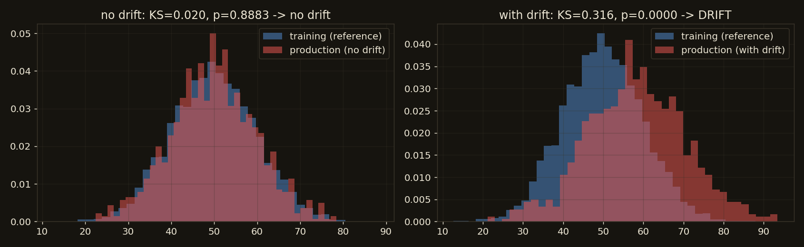

# Observability

Your service is live. How do you know it's working, and how do you debug it when it isn't? Observability is the ability to understand a system's internal state from its outputs. It has three pillars, and ML adds a fourth concern that generic observability misses entirely.

!!! tip "Rapid Recall"
    The three pillars are complementary, not redundant: logs are detailed per-event records ("what happened at this moment"), metrics are aggregated numbers over time ("what's the overall health"), and traces follow one request across services ("where did the time go"). Metrics say something is wrong, traces say where, logs say what exactly. Use structured JSON logs with a request id so aggregators can query fields. Track the RED method for request services (Rate, Errors, Duration) and USE for resources (Utilization, Saturation, Errors). The ML-specific layer is drift: a model can be infra-healthy (low latency, no errors) while silently making worse predictions because the world changed.

## §1 The three pillars

| Pillar | Question it answers | Granularity | Example |
|---|---|---|---|
| **Logs** | "What happened in detail at this moment?" | Per-event, high detail | "ERROR prediction failed: feature count mismatch, request_id=abc123" |
| **Metrics** | "What's the aggregate health over time?" | Aggregated numbers over time | "p99 latency = 240ms; 1500 req/s; 0.3% error rate" |
| **Traces** | "Where did the time go across services for this request?" | Per-request, across services | "request abc123: 5ms in API, 180ms in model, 12ms in DB" |

Logs are the detailed diary, rich and per-event, great for debugging a specific incident but expensive to store. Metrics are the dashboard gauges, cheap and aggregated, great for alerting and trends but with no per-event detail. Traces are the request's journey across services, showing where latency accumulates. They are **complementary, not redundant**: metrics tell you *something is wrong*, traces tell you *where*, logs tell you *what exactly*.

## §2 Structured logging

The key production upgrade is **structured logging** (JSON), so machines can parse and query your logs, not just humans reading text.

```python
import logging, json

class JSONFormatter(logging.Formatter):
    def format(self, record):
        obj = {"level": record.levelname, "service": record.name, "message": record.getMessage()}
        if hasattr(record, "extra_fields"):
            obj.update(record.extra_fields)
        return json.dumps(obj)

# Log a prediction event with structured fields you can later query/aggregate.
logger.info("prediction served", extra={"extra_fields": {
    "request_id": "req-abc123", "latency_ms": 45.2, "predicted_class": 1, "confidence": 0.93,
}})
```

With JSON, you can query `latency_ms > 100 AND predicted_class = 1` across millions of log lines in an aggregator (CloudWatch, Datadog, Elasticsearch); with plain text you are stuck grepping. Best practices: log at the right level (INFO normal, ERROR failures, DEBUG off in prod), never log secrets, PII, or full feature vectors, and attach a **`request_id`** on every line so you can correlate one request across services.

## §3 Metrics: RED and USE

Metrics are aggregated numbers tracked over time, scraped by systems like **Prometheus** and visualized in **Grafana**. Two standard frameworks for *what* to measure:

**RED method** (for request-driven services, your model API):

- **R**ate, requests per second
- **E**rrors, failed requests per second or error rate
- **D**uration, latency distribution (p50/p95/p99)

**USE method** (for resources, the machine):

- **U**tilization, percent busy (CPU, GPU, memory)
- **S**aturation, how much work is queued/waiting
- **E**rrors, hardware/resource errors

In production you don't hand-roll this, you use `prometheus-client` (which exposes a `/metrics` endpoint Prometheus scrapes) or a vendor SDK. Metrics are just counters and distributions aggregated over time, and you set **alerts** on them, for example page me if error rate exceeds 1% for 5 minutes or if p99 latency goes above 500ms.

## §4 Tracing

In a microservices system one request might hop through API gateway, auth, model service, feature store, and database. If it's slow, which hop is to blame? A **trace** follows one request end to end. It's made of **spans**, each one unit of work (a service call, a DB query) with a start time, duration, and parent span. Together they form a tree showing exactly where time went. The standard is **OpenTelemetry** (vendor-neutral); backends include Jaeger, Zipkin, and Datadog APM.

Metrics tell you p99 latency spiked to 800ms, but where? The trace shows the request spent 700ms in the feature store, not the model. In a monolith you can often live without it; in microservices it's essential.

## §5 ML-specific monitoring: drift

A model can be perfectly healthy by infra metrics (low latency, no errors) while **silently making worse predictions** because the world changed. This is unique to ML and easy to forget.

- **Data drift**: incoming feature distributions shift away from training data. Detect with statistical tests (KS test, population stability index) comparing live feature distributions to a training reference.
- **Prediction drift**: the model's output distribution shifts (suddenly predicting "fraud" 3x more often). A cheap early-warning signal even without ground truth.
- **Concept drift**: the relationship between features and target changes. Detectable only once ground-truth labels arrive.
- **Model performance decay**: accuracy or AUC on delayed ground truth, tracked over time. The ultimate signal, but it lags because labels arrive late.

A simple data-drift check uses the KS test to compare a training reference against live production:

```python
from scipy import stats

ks_stat, p_value = stats.ks_2samp(training_feature, production_feature)
drifted = p_value < 0.05    # significant distribution shift -> investigate/retrain
```

<figure class="diagram diagram-dark" markdown="1">
  
  <figcaption>No drift (left): production matches the training reference. With drift (right): the distribution shifted, and the KS test flags it.</figcaption>
</figure>

The production monitoring stack for ML therefore has two layers: **infra observability** (logs, metrics, traces, is the *service* healthy?) and **ML observability** (drift, performance decay, is the *model* still good?). Tools like Evidently, WhyLabs, Arize, and Fiddler specialize in the second layer. A model that passes every infra check can still be quietly failing, which is why ML monitoring is its own discipline.

## §6 Closeout: the interview synthesis

When asked "how would you deploy this model?", a strong answer walks the stack:

> "I'd wrap the model in a FastAPI service, load the model once at startup, validate inputs with Pydantic, expose `/predict` and `/health`. For an I/O-light tabular model I'd use sync endpoints in a threadpool with a few uvicorn workers to use all cores. I'd containerize with a slim multi-stage Dockerfile, push to a registry, and deploy on a container service like Fargate or Cloud Run with autoscaling on p95 latency, keeping the service stateless. For observability I'd emit structured JSON logs with request IDs, track RED metrics with alerts on error rate and p99, and add ML-specific drift monitoring since infra health doesn't catch model decay."

That single paragraph touches every page of this section: [concurrency](concurrency.md), [asyncio](asyncio.md), [FastAPI](fastapi-serving.md), [serving](serving-batching.md), [Docker and deployment](docker-deploy.md), and observability.

## Interview Questions

**Q: What's the difference between logging, metrics, and tracing?**
Logs are detailed per-event records ("what happened at this moment"), rich for debugging a specific incident but expensive to store. Metrics are aggregated numbers over time ("what's the overall health"), cheap for dashboards and alerts but with no per-event detail. Traces follow one request across services ("where did the time go"), essential for finding bottlenecks in microservices. They are complementary: metrics say something's wrong, traces say where, logs say what exactly.

**Q: What metrics would you track for a model-serving API?**
The RED method: Rate (requests per second), Errors (error rate), and Duration (latency p50/p95/p99), plus resource USE metrics (CPU/GPU/memory utilization and saturation). And, uniquely for ML, drift and model-performance metrics, because a service can be infra-healthy while the model silently degrades.

**Q (trap): My model service has great latency and zero errors, but business metrics are dropping. What might be wrong?**
The model is probably drifting, infra is healthy but predictions degraded because the input distribution or the feature-target relationship changed since training. Generic observability won't catch this; you need ML-specific monitoring: data drift (KS test or PSI on feature distributions), prediction drift (output distribution shift), and model performance on delayed labels. The fix is usually retraining on recent data.

**Q: What is a correlation ID and why does it matter?**
A unique ID attached to a request and propagated through every service and log line it touches. It lets you reconstruct everything that happened for one request across distributed logs and link logs to traces. Without it, debugging "what happened to request X" in a high-traffic multi-service system is nearly impossible. Generate it at the entry point or accept it from the client and pass it downstream.
