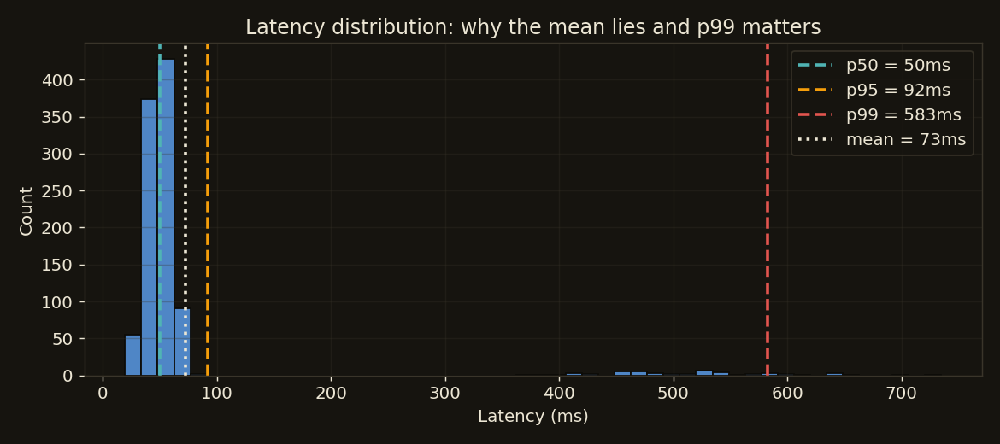

# Serving and Batching

You have a model behind a FastAPI endpoint. Now: how do you serve it efficiently, low latency and high throughput under real load? This page is the two numbers that define serving, the batching lever, the framework landscape, and how the pieces fit.

!!! tip "Rapid Recall"
    Two numbers define serving: latency (how long one request takes, measured in percentiles where p99 matters most) and throughput (requests per second). They trade off: batching raises throughput but adds latency while the batch fills. Report percentiles, not averages, because a 50ms mean can hide a 2s p99. Batching is the core throughput lever, vectorized inference amortizes per-call overhead, which is why serving frameworks batch. Pick FastAPI plus uvicorn for custom logic and a single model; reach for BentoML, Ray Serve, Triton, or vLLM only when you hit real scale or GPU/LLM-specific needs. Don't over-engineer.

## §1 Latency and throughput

- **Latency** is how long one request takes end to end, measured in percentiles: **p50** (median), **p95**, **p99** (tail). The tail matters most: "p99 latency = 800ms" means 1% of users wait 800ms or more. SLAs are written on p95 or p99, not the average.
- **Throughput** is how many requests per second the system handles.

These **trade off**. Batching requests together raises throughput (the GPU/CPU processes many at once efficiently) but raises latency (a request waits for the batch to fill). The serving system's job is to balance them for your SLA.

Why percentiles, not averages: averages hide tail behavior. A service with 50ms average latency might have 2s p99, and that p99 is what frustrates users and trips timeouts.

<figure class="diagram diagram-dark" markdown="1">
  
  <figcaption>Most requests are fast, a few are slow; the mean sits well below p99, which is the latency users actually feel.</figcaption>
</figure>

## §2 Batching, the throughput lever

Processing requests one at a time underuses hardware (especially GPUs, which are built for parallel batch math). **Batching** groups requests and runs inference on them together.

- **Static batching** waits until you have N requests, then processes. Simple but adds latency for the first request in a batch.
- **Dynamic batching** processes whatever has accumulated after a short time window (for example 5ms) or when the batch hits max size, whichever comes first. Balances latency and throughput. This is what production serving frameworks (Triton, vLLM, TF Serving) do.

The payoff is large because vectorized inference amortizes per-call overhead:

```python
# Per-item: predict 2000 times, like 2000 separate requests handled one by one.
per_item = [model.predict(x.reshape(1, -1))[0] for x in X_load]

# Batched: one predict call on all 2000 rows. Often 10x-100x faster.
batched = model.predict(X_load)
```

This is why serving frameworks batch: a single vectorized call does the work of thousands of tiny ones. In LLM serving the analogue is continuous batching, which lets new requests join as old sequences finish.

## §3 The serving framework landscape

You don't always hand-roll serving with FastAPI. The options, from simplest to most specialized:

| Tool | Use for | Strengths | Tradeoffs |
|---|---|---|---|
| FastAPI + uvicorn | Custom logic, single/few models, full control | Simple, flexible, you own everything | You build batching/versioning/metrics yourself |
| BentoML | Packaging + serving with batching built in | Adaptive batching, model store, easy deploy | Another framework to learn |
| Ray Serve | Multi-model, Python-native, scalable pipelines | Scales across a cluster, composable, autoscaling | Ray cluster overhead |
| NVIDIA Triton | High-performance GPU serving, multi-framework | Top GPU throughput, dynamic batching, multi-model | Heavier setup; mostly GPU |
| TF Serving / TorchServe | Framework-specific serving | Optimized for their framework, versioning | Tied to one framework |
| vLLM / TGI | LLM serving specifically | PagedAttention, continuous batching, huge LLM throughput | LLM-only |

The decision guide: one sklearn/xgboost model with custom logic, FastAPI + uvicorn; batching and versioning without building it, BentoML; many models and cluster scale, Ray Serve; GPU models at max throughput, Triton; serving LLMs, vLLM or TGI. Don't over-engineer: for most "serve one tabular model" jobs, FastAPI + uvicorn + a couple of workers is the right answer.

## §4 How the pieces fit

The full serving stack, with each layer mapping to a concept in this section:

```
   Client request
        -> [Load balancer]        distributes across instances, health checks
        -> [uvicorn/gunicorn]     N worker processes (multiprocessing -> use all cores)
        -> [FastAPI app]          async I/O concurrency per worker, validation
        -> [Model in memory]      loaded once at startup; optional dynamic batching
        -> [Response] + [metrics/logs/traces emitted]
```

Every layer maps to a concept here: load balancer (deployment), worker processes (multiprocessing), FastAPI async (the framework), batching (this page), and metrics/logs/traces ([observability](observability.md)).

## Interview Questions

**Q: What are the two numbers that define serving, and how do they trade off?**
Latency (how long one request takes, reported as p50/p95/p99) and throughput (requests per second). They trade off because batching requests together raises throughput by using the hardware efficiently, but adds latency since a request waits for the batch to fill. The serving system balances them against the SLA, usually written on p95 or p99.

**Q: Why report p99 latency instead of the mean?**
Because the mean hides the tail. A service with a 50ms average can have a 2s p99, meaning 1% of requests are painfully slow, tripping client timeouts and frustrating users. SLAs are written on percentiles because tail latency is what users feel and what cascades into failures at scale.

**Q: Why do serving frameworks batch, and what is the difference between static and dynamic batching?**
Because vectorized inference amortizes per-call overhead, one batched call does the work of thousands of tiny ones, which is critical for GPUs built for parallel math. Static batching waits for N requests then runs, adding latency for the first arrival. Dynamic batching runs whatever has accumulated after a short window or at max size, balancing latency and throughput, which is what Triton and vLLM do.

**Q: When should you reach past FastAPI for a dedicated serving framework?**
When you hit real scale or GPU/LLM-specific needs: BentoML for built-in batching and versioning, Ray Serve for many models and cluster scale, Triton for max GPU throughput, vLLM or TGI for LLMs. For a single tabular model with custom logic, FastAPI plus uvicorn and a couple of workers is the right, non-over-engineered answer.
