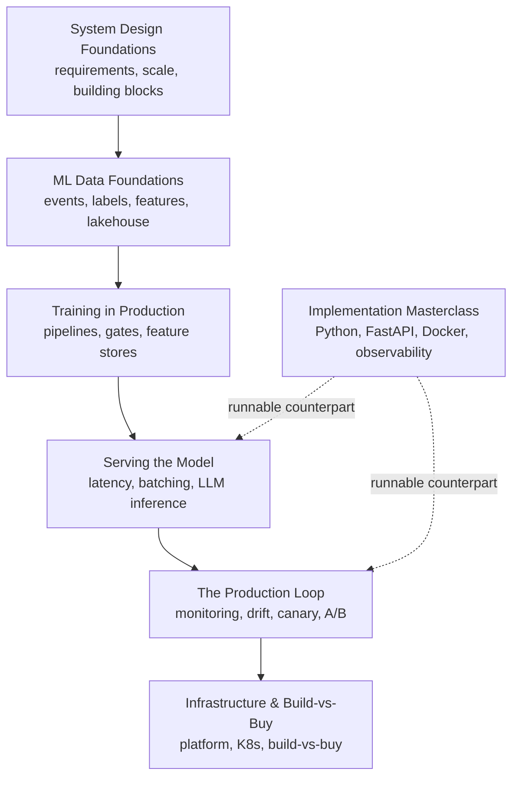

# Productionizing ML — Study Notes

These are my interview-prep study notes for taking machine learning from a notebook to a production system. They cover the conceptual system-design curriculum (a running checkout-fraud scenario threads through it) and a hands-on implementation masterclass with the Python, FastAPI, Docker, and observability patterns that close the gap between "my model works on my laptop" and "my model serves 1000 requests per second reliably."

!!! abstract "How to use this site"
    Read top to bottom for the full arc, or jump to a section by the tab bar. Every content page has the same shape: a **Rapid Recall** callout at the top for the 10-minute pre-interview skim, then the deep explanation with diagrams inline, then **Interview Questions** at the bottom. The first six sections build the concepts; the final section, the Implementation Masterclass, is the runnable code layer.

## The arc

## The seven sections

- **[System Design Foundations](sysdesign/index.md)** — how to approach a system design interview before ML complexity: requirements, back-of-envelope scale, the standard request path, the twelve building blocks, latency and capacity, and worked case studies.
- **[ML Data Foundations](data/index.md)** — why ML data differs: events to training examples, prediction time, labels as products, features and leakage, formats and storage, pipelines and the lakehouse.
- **[Training in Production](training/index.md)** — the production training lifecycle: pipeline anatomy, baselines, experiment tracking and versioning, distributed training, evaluation gates and CI/CD, feature stores, and LLM post-training.
- **[Serving the Model](serving/index.md)** — inference after promotion: serving modes, the online path and latency budget, batching and caching, model compression, LLM serving from first principles, runtimes, and failures.
- **[The Production Loop](loop/index.md)** — what happens after deployment: model decay, prediction logging, delayed labels, production evaluation, drift, deployment strategies, A/B and bandits, and incident playbooks.
- **[Infrastructure & Build-vs-Buy](infra/index.md)** — platform thinking: the four layers, storage and compute, orchestration, ML platform anatomy and Kubernetes, security, governance, cost, and the build-vs-buy decision.
- **[Implementation Masterclass](impl/index.md)** — the runnable code layer: concurrency and the GIL, asyncio, FastAPI and model serving, batching, Docker and deployment, and observability.

## Reading paths

1. **Conceptual curriculum:** System Design → Data Foundations → Training → Serving → Production Loop → Infrastructure.
2. **Implementation-first:** skim System Design and Serving, then work through the Implementation Masterclass and run the patterns.
3. **Serving and FastAPI:** the Serving section for concepts, then the Masterclass FastAPI and serving pages for code.
4. **Post-launch:** the Production Loop for monitoring and experiment concepts, then the Masterclass Observability page for the logging, metrics, tracing, and drift code.
