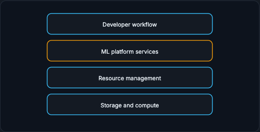

# Infrastructure and Build-vs-Buy

Infrastructure is the shared machinery that makes ML work repeatable. It is not just Kubernetes. It is the combination of storage, compute, orchestration, registries, serving, monitoring, security, governance, and cost controls that lets many models move from data to training to serving to production feedback. This section is the capstone that ties the previous five together.

!!! tip "Rapid Recall"
    Infrastructure is everything that lets ML teams do the same lifecycle safely more than once. It reduces accidental work by answering, once, where artifacts live, how training is scheduled, how to get a GPU, how to deploy and rollback, where logs go, who can access PII, how to monitor drift, and how to control cost. A useful model is four layers: storage and compute (the raw materials), resource management (where and when work runs), ML platform services (reusable lifecycle capabilities), and developer workflow (how humans interact with all of it). Bad infrastructure hides complexity until failure: a notebook that trains but cannot reproduce, an endpoint that serves but cannot log features, a Kubernetes cluster with no registry, feature store, or monitoring is not an ML platform.

## Running Example: Fraud ML Platform

Imagine your company now has several ML systems: checkout fraud, recommendation ranking, churn prediction, support-ticket classification, and an internal LLM assistant. If every team builds its own data pipelines, training scripts, model registry, serving stack, monitoring dashboards, and access controls, the organization becomes inconsistent and fragile. Infrastructure provides shared primitives so teams do not reinvent the lifecycle every time.

## §1 What Infrastructure Means in ML Systems

Infrastructure is everything that lets ML teams do the same lifecycle safely more than once.

A data scientist can train a model on a laptop. That is not a production ML system. A production organization needs repeated workflows: ingest data, validate data, compute features, train candidates, track experiments, register models, deploy endpoints, monitor predictions, collect labels, retrain, and audit decisions. Infrastructure is the shared foundation that makes those workflows reliable.

Think of infrastructure as reducing accidental work. Without a platform, every team asks the same questions: where do I store artifacts, how do I schedule training, how do I get a GPU, how do I deploy, how do I rollback, where do logs go, who can access PII, how do I monitor drift, how do I control cost? Good infrastructure answers these once.

Bad infrastructure hides complexity until failure. A notebook that can train a model but cannot reproduce it is not enough. An endpoint that can serve predictions but cannot log features is not enough. A Kubernetes cluster that can run containers but has no model registry, feature store, or monitoring is not an ML platform by itself.

## §2 The Four Infrastructure Layers

A useful mental model is four layers: storage and compute, resource management, ML platform services, and developer workflow.

**Storage and compute** are the raw materials: object stores, warehouses, lakehouses, online stores, vector stores, CPUs, GPUs, TPUs, and networks. **Resource management** decides where work runs and when: Airflow, Dagster, Argo, Kubeflow, Kubernetes, Ray, queues, schedulers. **ML platform services** provide reusable ML capabilities: experiment tracking, model registry, feature store, serving, monitoring. **Developer workflow** is how humans interact with all of it: notebooks, IDEs, Git, CI/CD, environments, secrets, dev/staging/prod.

<figure class="diagram diagram-dark" markdown="1">
  
  <figcaption>The four layers: developer workflow on top, then ML platform services, resource management, and storage and compute as the substrate.</figcaption>
</figure>

- **Developer workflow:** notebooks, IDEs, Git, CI/CD, environments, secrets, and dev/staging/prod parity. This is how humans safely change the system.
- **ML platform services:** experiment tracking, model registry, feature store, serving, monitoring, governance. These are reusable lifecycle capabilities.
- **Resource management:** Airflow, Dagster, Argo, Kubeflow, Kubernetes, Ray, queues, and schedulers. This layer runs work reliably.
- **Storage and compute:** object stores, warehouses, lakehouses, online stores, vector stores, CPUs, GPUs, TPUs. This is the substrate.

## Where to go next

- [Storage and Compute](storage-compute.md) on the storage taxonomy and compute shapes.
- [Orchestration](orchestration.md) on DAGs, retries, and backfills.
- [ML Platform and Kubernetes](platform-k8s.md) on platform capabilities and GPU scheduling.
- [Governance and Cost](governance-cost.md) on security, governance, and cost controls.
- [Build vs Buy and Capstone](build-vs-buy.md) on the decision and the end-to-end answer.

## Interview Questions

**Q1: What does infrastructure actually mean in an ML system?**
Everything that lets a team run the same lifecycle safely more than once: ingest, validate, feature, train, track, register, deploy, monitor, collect labels, retrain, audit. It reduces accidental work by answering the recurring questions once, where artifacts live, how training is scheduled, how to get a GPU, how to deploy and rollback, where logs go, who can access PII, how to monitor drift, and how to control cost.

**Q2: Why isn't a Kubernetes cluster an ML platform?**
Because Kubernetes can run containers but does not by itself give you a model registry, feature store, evaluation gates, lineage, or drift monitoring. Those are ML platform services that sit above raw orchestration. A cluster that runs pods but cannot reproduce a model or log features is missing the lifecycle capabilities that make ML repeatable.

**Q3: Describe the four-layer mental model for ML infrastructure.**
Storage and compute are the raw materials (object stores, warehouses, online and vector stores, CPUs, GPUs, TPUs). Resource management decides where and when work runs (Airflow, Argo, Kubernetes, Ray, schedulers). ML platform services provide reusable capabilities (tracking, registry, feature store, serving, monitoring). Developer workflow is how humans interact with all of it (notebooks, Git, CI/CD, environments, secrets). Each layer builds on the one below.
