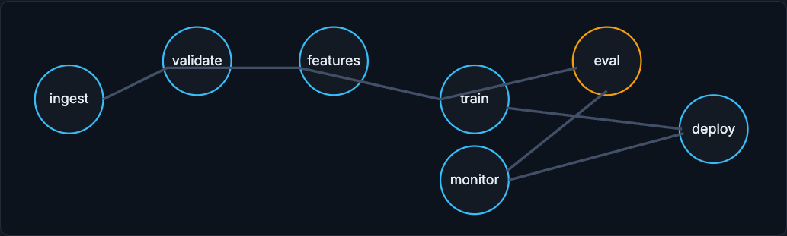

# Orchestration

Orchestration is how tasks become a reliable workflow instead of a pile of scripts. ML pipelines have real dependencies, and the orchestrator is what makes a failure stop the right downstream work instead of silently corrupting it.

!!! tip "Rapid Recall"
    A cron job runs one script; an ML pipeline has dependencies (ingest, validate, features, train, evaluate, register, deploy, monitor) where a failure upstream must stop downstream work. A DAG expresses those dependencies, and tools like Airflow, Dagster, Prefect, Argo, Kubeflow, SageMaker, and Vertex Pipelines all share the same idea: define tasks, dependencies, parameters, retries, schedules, logs, and outputs. Backfills are one of the most important use cases: recomputing a wrongly-computed feature over months without corrupting production is why idempotency, partitioning, lineage, and write-audit-publish workflows matter.

## §1 From scripts to reliable workflows

Orchestration is how tasks become a reliable workflow instead of a pile of scripts.

A cron job can run one script every night. But ML pipelines usually have dependencies: ingest data, validate schema, compute features, build training set, train model, evaluate, register, deploy, monitor. If validation fails, training should stop. If feature computation fails, training should not use stale features silently. If evaluation fails, deployment should not happen.

A DAG expresses these dependencies. Airflow, Dagster, Prefect, Argo Workflows, Kubeflow Pipelines, SageMaker Pipelines, and Vertex AI Pipelines are examples of orchestration systems. They differ in ergonomics and platform integration, but the concept is the same: define tasks, dependencies, parameters, retries, schedules, logs, and outputs.

<figure class="diagram diagram-dark" markdown="1">
  
  <figcaption>A DAG expresses task dependencies: a failed validate or eval stops the downstream train or deploy.</figcaption>
</figure>

## §2 Backfills

Backfills are one of the most important orchestration use cases. Suppose a feature was computed incorrectly for three months. You need to recompute those partitions, validate them, publish them safely, maybe retrain models, and avoid corrupting current production data. This is why idempotency, partitioning, lineage, and write-audit-publish workflows matter.

## Interview Questions

**Q1: Why is a DAG better than a cron job for an ML pipeline?**
Because ML pipelines have dependencies that a single cron script cannot express: if validation fails, training must stop; if feature computation fails, training must not silently use stale features; if evaluation fails, deployment must not happen. A DAG encodes those task dependencies, retries, schedules, and outputs so a failure propagates correctly instead of producing a quietly broken model.

**Q2: What do all the orchestration tools have in common?**
Despite differing in ergonomics and platform integration, Airflow, Dagster, Prefect, Argo, Kubeflow, SageMaker Pipelines, and Vertex Pipelines all implement the same concept: define tasks, their dependencies, parameters, retries, schedules, logs, and outputs. The tool choice is mostly about integration and developer experience, not the underlying idea.

**Q3: Why are backfills one of the hardest orchestration problems?**
Because recomputing a feature that was wrong for three months means reprocessing many historical partitions, validating them, publishing safely, and possibly retraining, all without corrupting current production data. That demands idempotency so reruns are safe, partitioning so you touch only the affected ranges, lineage so you know what was affected, and write-audit-publish so bad data never goes live.
