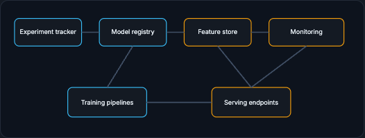

# ML Platform and Kubernetes

An ML platform is not one tool. It is a set of lifecycle capabilities that work together. Kubernetes can run the containers underneath, but ML both uses it and stretches it, especially around scarce, expensive GPUs.

!!! tip "Rapid Recall"
    An ML platform is a set of lifecycle capabilities: experiment tracker, model registry, feature store, serving, monitoring, CI/CD gates, and governance. Talk about platforms by capability, not product: say what you need (tracking, registry, reproducible pipelines, feature consistency, serving, monitoring, access control, cost visibility), then decide to buy or compose it. Kubernetes schedules pods, restarts failures, and autoscales, but ML stretches it because GPUs are expensive, scarce, heterogeneous, and memory-constrained. GPU scheduling concerns include bin-packing, isolation, topology, warmup, MIG partitions, time-slicing, and cold starts. Ray is a distributed Python compute framework inside the platform, not a replacement for storage, lineage, CI/CD, or monitoring.

## §1 ML Platform Anatomy

An ML platform is not one tool. It is a set of lifecycle capabilities that work together.

An experiment tracker records training runs. A model registry stores artifacts and stage transitions. A feature store connects training and serving features. A serving platform deploys endpoints, routes traffic, and autoscaling. A monitoring platform tracks system/data/model/business signals. CI/CD enforces gates. Governance controls permissions, lineage, approvals, and audit logs.

<figure class="diagram diagram-dark" markdown="1">
  
  <figcaption>The platform as connected capabilities: tracker, registry, feature store, monitoring, training pipelines, and serving endpoints.</figcaption>
</figure>

Tools map to pieces. MLflow can track experiments and register models. W&B can track runs, artifacts, and collaborative reports. Feast provides feature-store primitives. Tecton provides managed feature pipelines. KServe, BentoML, Ray Serve, Triton, and vLLM help serving. Evidently, Arize, Fiddler, WhyLabs, and custom dashboards help monitoring. SageMaker, Vertex AI, Databricks, and Azure ML package many capabilities into managed platforms.

The right way to talk about platforms is by capability. Do not say "we need SageMaker" first. Say "we need experiment tracking, artifact registry, reproducible pipelines, feature consistency, serving, monitoring, access control, and cost visibility. We can buy these as a managed platform or compose them from open-source tools."

!!! note "Key distinction"
    Kubernetes can run containers. It does not automatically give you model lineage, feature correctness, evaluation gates, or drift monitoring. Those are platform services above raw orchestration.

## §2 Kubernetes, Ray, and GPU Scheduling

Kubernetes is a general container orchestration system. ML uses it, but ML also stretches it.

Kubernetes schedules pods onto nodes, restarts failed pods, exposes services, manages deployments, and supports autoscaling. For ordinary web services, CPU and memory requests may be enough. For ML, accelerators complicate things. GPUs are expensive, scarce, heterogeneous, and memory-constrained. A pod asking for one GPU may underuse it; several small models may fit on one GPU; one giant model may need many GPUs.

GPU scheduling concerns include bin-packing, isolation, topology, model warmup, driver management, MIG partitions, time-slicing, queue-based autoscaling, and cold starts. Tools such as NVIDIA GPU Operator, Kueue, Karpenter/Cluster Autoscaler, KServe, Ray/KubeRay, vLLM, and Triton often appear in modern stacks, but again the concept matters: keep expensive accelerators utilized without violating latency or isolation.

Ray is useful for distributed Python workloads: training, tuning, batch inference, reinforcement learning, and serving. It can run on Kubernetes through KubeRay. It is not a replacement for understanding storage, lineage, CI/CD, or monitoring; it is a compute framework inside the bigger platform.

## Interview Questions

**Q1: How should you talk about an ML platform in an interview?**
By capability, not product. Instead of opening with "we need SageMaker," state the capabilities required: experiment tracking, artifact registry, reproducible pipelines, feature consistency, serving, monitoring, access control, and cost visibility, then decide whether to buy them as a managed platform or compose them from open-source tools. Leading with capabilities shows you understand the lifecycle rather than a vendor.

**Q2: Why does ML stretch Kubernetes beyond ordinary web serving?**
Because GPUs are expensive, scarce, heterogeneous, and memory-constrained, unlike fungible CPU and memory. One pod may underuse a GPU, several small models may share one, and a giant model may need many, so scheduling has to handle bin-packing, isolation, topology, warmup, MIG partitions, time-slicing, queue-based autoscaling, and cold starts. The goal is keeping costly accelerators utilized without violating latency or isolation.

**Q3: Where does Ray fit in the platform?**
Ray is a distributed Python compute framework for training, tuning, batch inference, reinforcement learning, and serving, and it can run on Kubernetes via KubeRay. It is one compute layer inside the larger platform, not a substitute for storage, lineage, CI/CD, or monitoring. Treating it as the whole platform would leave out the lifecycle services that make ML repeatable.
