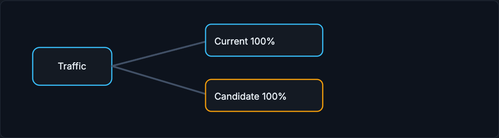
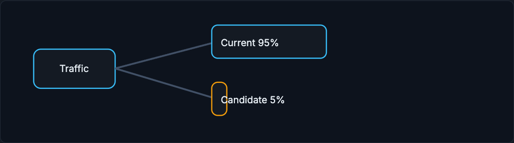
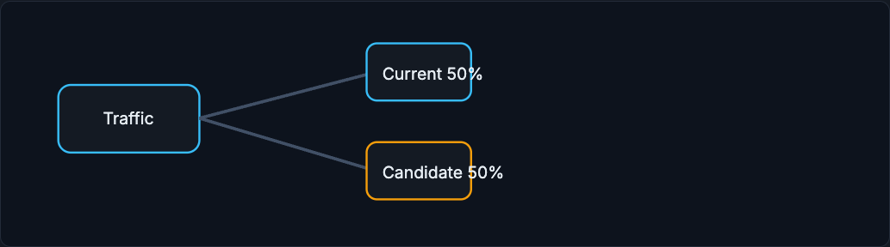

# Deployment Strategies

Deployment strategies limit blast radius while you learn whether a new model is safe. Each one exposes the candidate to a different amount of risk and answers a different question, so the choice follows from how fast metrics arrive and how much risk is acceptable.

!!! tip "Rapid Recall"
    Shadow deployment copies production traffic to the candidate but ignores its output, so you compare predictions, latency, and feature availability without affecting users, but you cannot measure behavior change. Canary sends a small percentage of live traffic to the candidate, watches guardrails, then ramps. A/B testing randomizes users between control and treatment to estimate causal business impact, needing careful sample size, randomization unit, and no peeking. Interleaving mixes two rankers' results in one list and infers preference from clicks, often needing less traffic than a full A/B for ranking quality.

## §1 Shadow deployment

Shadow deployment sends a copy of production traffic to the candidate model but ignores its output. You compare predictions, latency, feature availability, and errors without affecting users. It cannot measure user behavior changes because users do not see the candidate's decisions.

<figure class="diagram diagram-dark" markdown="1">
  
  <figcaption>Shadow: copy traffic to the candidate and ignore its decision, to compare safely without affecting users.</figcaption>
</figure>

## §2 Canary release

Canary release sends a small percentage of live traffic to the candidate. You watch guardrails, then ramp up. Canary is useful when risk is acceptable and metrics arrive quickly.

<figure class="diagram diagram-dark" markdown="1">
  
  <figcaption>Canary: small live exposure to the candidate; ramp only if the guardrails hold.</figcaption>
</figure>

## §3 A/B testing

A/B testing randomizes users or entities between control and treatment. It estimates causal business impact, but needs careful design: sample size, randomization unit, guardrails, and no peeking.

<figure class="diagram diagram-dark" markdown="1">
  
  <figcaption>A/B: randomized users split between current and candidate to estimate causal business impact.</figcaption>
</figure>

## §4 Interleaving

Interleaving is used for ranking and search. Results from two rankers are mixed in one list, and clicks infer which ranker users prefer. It can need less traffic than a full A/B test for ranking quality.

<figure class="diagram diagram-dark" markdown="1">
  
  <figcaption>Interleaving: mix two rankers' outputs in one list and infer preference from clicks.</figcaption>
</figure>

## Interview Questions

**Q1: What does shadow deployment measure, and what can it not measure?**
It sends a copy of production traffic to the candidate while ignoring its output, so you can compare predictions, latency, feature availability, and errors against the live model with zero user risk. What it cannot measure is user behavior change, because users never see the candidate's decisions, so it validates mechanics and quality but not causal product impact.

**Q2: When would you choose a canary over a full A/B test?**
When risk is acceptable and metrics arrive quickly. A canary exposes a small percentage of live traffic to the candidate, lets you watch guardrails, and ramps up if they hold, giving fast real-world feedback with limited blast radius. A full A/B test is heavier and is for estimating causal business impact with statistical rigor.

**Q3: What must an A/B test get right to give a trustworthy result?**
A clear randomization unit, an adequate sample size, predeclared primary and guardrail metrics, and no peeking. A/B randomizes users between control and treatment to estimate causal impact, so stopping early when the p-value looks good inflates false positives. The design discipline is what makes the causal claim credible.

**Q4: Why use interleaving for ranking instead of A/B?**
Because interleaving mixes the results of two rankers into a single list and infers preference directly from which results users click, it can detect ranking-quality differences with less traffic than a full A/B test. For search and recommendation ranking specifically, that sensitivity makes it an efficient way to compare rankers.
