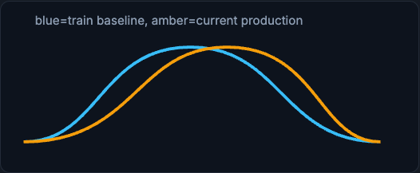

# Drift and Monitoring

Drift means the data-generating process changed. The important question is which part changed and whether the change harms decisions. This page separates the three drift types, surveys detection methods, and then distinguishes monitoring (known signals) from observability (investigating the unknown).

!!! tip "Rapid Recall"
    Covariate shift means P(x) changed: inputs look different, and the model may still work if the input-label relationship is stable. Label shift means P(y) changed: the base rate moved, so ranking may hold but thresholds need adjustment. Concept drift means P(y|x) changed: the same input now means something different, which is often the most serious because the learned relationship is stale. Detection methods (PSI, KS, KL, MMD, adversarial validation) all have tradeoffs, and repeated testing across many features creates false alerts. Most important: drift is evidence, not an automatic retraining trigger. Monitoring watches known signals; observability lets you investigate unknown failures across system, data, model, label, and business layers.

## §1 The three kinds of drift

**Covariate shift** means P(x) changed: input features look different. Example: more mobile traffic, new countries, larger transaction amounts, new payment method. The model may still work if the relationship between inputs and labels is stable, but it is now operating in a less familiar region.

<figure class="diagram diagram-dark" markdown="1">
  
  <figcaption>Covariate shift, P(x): the input distribution moves while the input-label relationship may be unchanged.</figcaption>
</figure>

**Label shift** means P(y) changed: the base rate changed. Example: fraud prevalence doubles during an attack. The model's ranking may remain useful, but thresholds may need adjustment.

<figure class="diagram diagram-dark" markdown="1">
  
  <figcaption>Label shift, P(y): the base rate changes, so ranking may hold but thresholds may need adjustment.</figcaption>
</figure>

**Concept drift** means P(y|x) changed: the meaning of the same input changed. Example: a behavior pattern that used to be benign becomes fraud because attackers adopt it. This is often more serious because the model's learned relationship is stale.

<figure class="diagram diagram-dark" markdown="1">
  
  <figcaption>Concept drift, P(y|x): the same input now means something different, so the learned mapping is stale.</figcaption>
</figure>

## §2 Detection methods

Detection methods include summary statistics, missingness, quantiles, skew, kurtosis, PSI, KS tests, KL divergence, Jensen-Shannon distance, MMD, and adversarial validation. Each has tradeoffs. KS is sensitive to sample size. PSI is interpretable but can miss subtle changes. KL depends on binning and is asymmetric. Repeated testing across many features creates false alerts.

Population Stability Index is a common, interpretable score that compares a baseline distribution against the current one across bins:

\[
\text{PSI} = \sum_{i} (p_i - q_i)\,\ln\!\frac{p_i}{q_i}
\]

where \(p_i\) is the baseline fraction in bin \(i\) and \(q_i\) is the current fraction. KL divergence, \(\sum_i p_i \ln(p_i/q_i)\), is related but asymmetric and binning-dependent, while the KS statistic compares the maximum gap between two cumulative distributions.

Most important: drift is evidence, not an automatic retraining trigger. If a feature drifts but business metrics and labels are stable, you may watch. If a critical feature drifts and fraud loss rises, you act.

!!! warning "Threshold warning"
    PSI rules such as 0.1 or 0.25 are conventions, not physics. Tune thresholds to model sensitivity, traffic volume, and business impact.

## §3 Monitoring vs Observability

Monitoring watches known signals. Observability lets you investigate unknown failures.

Monitoring dashboards might show p99 latency, error rate, feature null rate, drift scores, approval rate, fraud score distribution, and chargeback rate. These answer questions you expected.

Observability lets you ask new questions. If chargebacks rise, you need to slice by model version, payment method, country, device, feature freshness, traffic source, and threshold. You need logs, metrics, traces, prediction records, feature timestamps, and label joins. Without this evidence, you cannot distinguish model drift from a logging bug or product launch.

| Layer | Examples | Question answered |
|---|---|---|
| System | latency, errors, saturation, queue lag | Can the serving path respond? |
| Data | schema, nulls, ranges, freshness, drift | Are inputs trustworthy? |
| Model | score distribution, calibration, slices | Are predictions behaving? |
| Labels | delay, coverage, performance | Are predictions correct once truth arrives? |
| Business | fraud loss, approval rate, revenue | Is the product outcome improving? |

## Interview Questions

**Q1: Distinguish covariate shift, label shift, and concept drift.**
Covariate shift is P(x) changing: inputs look different but the input-label relationship may hold, so the model can still work in a less familiar region. Label shift is P(y) changing: the base rate moves, so ranking may stay useful but thresholds need adjustment. Concept drift is P(y|x) changing: the same input now maps to a different outcome, which is often the most serious because the learned relationship itself is stale.

**Q2: Is a drift alert a reason to retrain automatically?**
No. Drift is evidence, not an automatic trigger. If a feature drifts but labels and business metrics are stable, you may just watch. If a critical feature drifts and fraud loss rises, you act. Retraining on every drift alert wastes effort and can even retrain on a broken pipeline, so you connect drift to actual impact before acting.

**Q3: What are the tradeoffs among PSI, KS, and KL for drift detection?**
PSI is interpretable and bins the distributions, but can miss subtle changes; KS compares cumulative distributions and is sensitive to sample size; KL divergence depends on binning and is asymmetric. Testing many features repeatedly also inflates false alerts, so thresholds like PSI 0.1 or 0.25 are conventions to tune to model sensitivity, traffic volume, and business impact, not laws.

**Q4: How do monitoring and observability differ in the production loop?**
Monitoring watches signals you anticipated (p99 latency, error rate, null rate, drift, approval rate, chargeback rate) and answers expected questions. Observability lets you ask new questions when something unexpected happens, slicing by model version, payment method, country, device, freshness, and threshold using logs, traces, prediction records, and label joins. Without that evidence you cannot tell model drift from a logging bug or a product launch.
