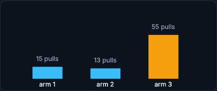

# Experiments and Playbooks

A/B testing asks whether a change caused an outcome. Bandits adapt allocation while learning. And when something breaks, retraining is only one of several possible responses. This page closes the production loop with experiment design, bandits, incident playbooks, and the synthesis answer.

!!! tip "Rapid Recall"
    A proper A/B test predeclares the hypothesis, randomization unit, primary and guardrail metrics, minimum detectable effect, sample size, duration, and stopping rule; repeated peeking inflates false positives. For ML, the primary metric should usually be a business metric, not just an ML metric. Bandits allocate more traffic to better arms while still exploring (epsilon-greedy, Thompson sampling), reducing regret but complicating clean statistics. When something breaks, retraining is only one action: fix the pipeline, recalibrate, adjust thresholds, rollback, or collect new labels depending on the root cause. The postmortem goal is to improve the loop, not just the current model.

## §1 A/B Testing and Bandits

A proper A/B test defines the hypothesis, randomization unit, primary metric, guardrail metrics, minimum detectable effect, sample size, duration, and stopping rule before launch. If you repeatedly peek and stop when the p-value looks good, you inflate false positives.

For ML systems, the primary metric should often be a business metric, not only an ML metric. A fraud model might optimize fraud loss, but guardrails include approval rate, false positive complaints, latency, and revenue. A recommender might optimize long-term retention, not just immediate clicks.

A rough significance intuition for a two-proportion comparison uses a z-score: with baseline rate \(b\), treatment rate \(p_2\), and \(n\) samples per arm,

\[
z = \frac{p_2 - b}{\sqrt{\dfrac{b(1-b)}{n} + \dfrac{p_2(1-p_2)}{n}}}
\]

For example, a baseline of 10%, a 5% relative lift (so \(p_2 = 0.105\)), and 5,000 per arm gives a standard error around 0.0061 and a z-score around 0.82, which is far from significant: the effect is too small for that sample size. This is simplified and assumes a fixed sample size with no peeking. Real experiments need predeclared metrics and guardrails.

Bandits allocate more traffic to arms that appear better while still exploring. Epsilon-greedy chooses a random arm sometimes and the best current arm otherwise. Thompson sampling samples from a posterior belief over each arm. Bandits reduce regret but complicate clean statistical interpretation.

<figure class="diagram diagram-dark" markdown="1">
  
  <figcaption>A bandit concentrates pulls on the arm that looks best while still exploring the others.</figcaption>
</figure>

## §2 Response Playbooks

Retraining is only one possible action. The right action depends on the failure mode.

If a feature pipeline is broken, retraining on broken data is wrong. Fix the pipeline or use fallback features. If calibration shifted but ranking remains good, recalibration or threshold adjustment may be enough. If a new model version caused harm, rollback. If user population changed permanently, collect new labels and retrain. If labels are delayed, use proxy metrics carefully until truth arrives.

A good incident response flow is: detect symptom, assess user/business impact, identify whether system/data/model/business layer is responsible, mitigate with rollback/fallback/rethreshold/human review, preserve evidence, repair root cause, and add a test or monitor to prevent recurrence.

!!! note "Postmortem mindset"
    The goal is not only to fix the current model. The goal is to improve the loop: better data contracts, better gates, better alerts, better fallback, or better deployment process.

## §3 Interview Synthesis

> "After deployment, I would log model version, features, prediction, decision, latency, and label join keys for every request. I would monitor system metrics, data quality, feature freshness, prediction distributions, delayed label performance, and business KPIs by slice. I would distinguish covariate shift, label shift, and concept drift, and I would not automatically retrain on every drift alert. New models would go through shadow, canary, or A/B testing with guardrails. If quality degrades, the response could be rollback, threshold adjustment, feature pipeline fix, human review, or retraining depending on root cause."

## Interview Questions

**Q1: What must be decided before launching an A/B test, and why?**
The hypothesis, randomization unit, primary metric, guardrail metrics, minimum detectable effect, sample size, duration, and stopping rule, all before launch. Predeclaring them prevents the biggest mistake, repeated peeking and stopping when the p-value looks good, which inflates false positives. For ML the primary metric should usually be a business outcome, with ML and product guardrails alongside.

**Q2: How do bandits differ from a fixed A/B test?**
A bandit adaptively shifts more traffic to arms that currently look better while still exploring, using strategies like epsilon-greedy or Thompson sampling, which reduces regret during the experiment. The cost is that the changing allocation complicates clean statistical interpretation, whereas a fixed A/B test holds allocation constant to give a cleaner causal estimate.

**Q3: A drift alert fires. Why might retraining be the wrong response?**
Because the right action depends on the root cause. If a feature pipeline is broken, retraining on broken data makes things worse; fix the pipeline or use fallback features. If only calibration shifted, recalibrate or adjust thresholds. If a new version caused harm, rollback. If the population changed permanently, collect new labels and retrain. Retraining is one option among several.

**Q4: What is the postmortem mindset after an ML incident?**
To improve the loop, not just the current model. After detecting the symptom, assessing impact, locating the responsible layer, mitigating, and repairing the root cause, you add a test or monitor so it cannot recur. The lasting fixes are better data contracts, gates, alerts, fallback, and deployment process, which harden the whole system against the next failure.
