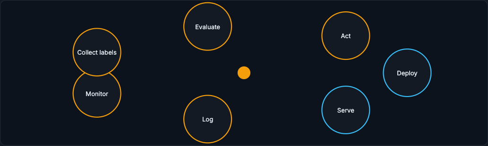

# The Production Loop

A deployed model is not done. It is a decision policy operating inside a changing product, a changing user population, and sometimes an adversarial world. The production loop is how you keep that model honest after launch.

!!! tip "Rapid Recall"
    The loop is: deploy, serve, log, monitor, collect labels, evaluate, decide action, retrain or rollback, redeploy. A model decays because the world it learned from is not frozen: fraudsters adapt, a new segment arrives, a payment method launches, a feature pipeline starts producing nulls, none of which require a code change yet all of which degrade predictions. There are also feedback loops: blocking a transaction hides whether it would have been fraud, so the model changes the data it later trains on. Production ML is therefore a loop, not a launch.

## Running Example: Fraud Model After Launch

Your checkout fraud model is live. It approves or blocks transactions in real time. For a few weeks it works. Then a new payment method launches, a festival sale changes user behavior, and fraudsters discover a loophole. The API is still healthy. Latency is fine. But business losses may be rising. How do you know? What do you monitor? When do you retrain? When do you rollback? That is the production loop.

## §1 Why Models Decay

A model decays because the world it learned from is not frozen.

In normal software, a function often keeps doing the same thing until code changes. If a tax calculation function is correct today, it may remain correct tomorrow unless tax law or code changes. ML is different. The model learned statistical relationships from past data. If the population, product, incentives, or data pipeline changes, those relationships may weaken.

In the fraud example, several things can change. Fraudsters adapt to the model and stop using patterns the model catches. Marketing brings in a new user segment. The product launches a new payment method. A logging change renames a field. A feature pipeline starts producing nulls. A manual review team changes policy. None of these require the model code to change, yet predictions can become worse.

There are also feedback loops. If the model blocks transactions, you may not observe whether those transactions would have become fraud. The model changes the data it later trains on. In recommendations, showing popular items creates more clicks on popular items, which makes them look even more popular. In fraud, blocking a segment can hide labels for that segment. Production ML is therefore a loop, not a launch.

<figure class="diagram diagram-dark" markdown="1">
  
  <figcaption>The production loop: deploy, serve, log, monitor, collect labels, evaluate, and act, then repeat.</figcaption>
</figure>

## Where to go next

- [Logging and Labels](logging-labels.md) on what to log and how delayed labels work.
- [Production Evaluation](production-evaluation.md) on calibration, slices, and Simpson's paradox.
- [Drift and Monitoring](drift.md) on the three drift types and observability layers.
- [Deployment Strategies](deployment-strategies.md) on shadow, canary, A/B, and interleaving.
- [Experiments and Playbooks](experiments-playbooks.md) on A/B statistics, bandits, and incident response.

## Interview Questions

**Q1: Why do ML models decay when ordinary software functions do not?**
Because a function keeps doing the same thing until its code changes, but a model encodes statistical relationships learned from past data. When the population, product, incentives, or data pipeline changes, those relationships weaken even though no code changed. Fraudsters adapting, a new user segment, a new payment method, or a pipeline producing nulls can all degrade predictions silently.

**Q2: What is a feedback loop in production ML, with an example?**
It is when the model's own decisions shape the data it later learns from. If the fraud model blocks a transaction, you never observe whether it would have been fraud, so labels for blocked segments are hidden. In recommendations, showing popular items generates more clicks on popular items, making them look even more popular. The model influences its own future training data.

**Q3: What are the stages of the production loop?**
Deploy, serve, log, monitor, collect labels, evaluate, decide an action, retrain or rollback, and redeploy. The point is that deployment is the start of an ongoing cycle, not the finish line: you continuously gather evidence, compare against delayed ground truth and business outcomes, and feed the result back into the next model.
