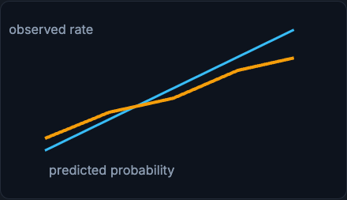

# Production Evaluation

Production evaluation asks whether the live model is doing the right thing for current users, not just whether it scored well on an old test set. That means adding current traffic, delayed labels, slices, calibration, robustness, and business outcomes to the offline picture.

!!! tip "Rapid Recall"
    A model can pass offline tests and fail in production because the world changed or the offline split was unrepresentative. Calibration asks whether probabilities mean what they say: if 1,000 transactions get probability around 0.8, about 800 should actually be fraud, which matters because thresholds drive actions. Slice evaluation checks performance by subgroup, because aggregate metrics hide regressions, and Simpson's paradox is the extreme where the aggregate conclusion reverses after splitting. Robustness tests reasonable perturbations; invariance tests that irrelevant changes leave predictions stable. The discipline is to never trust a single global number.

## §1 Why production evaluation differs from offline evaluation

Offline evaluation uses held-out historical data. Production evaluation adds current traffic, delayed labels, slices, calibration, robustness, and business outcomes. A model can pass offline tests and fail in production because the world changed or because the offline split was not representative.

## §2 Calibration

Calibration asks whether probabilities mean what they say. If 1,000 transactions receive fraud probability around 0.8, about 800 should actually be fraud for that group if the model is calibrated. Calibration matters when thresholds control actions. If scores are overconfident, you may block too many good users.

<figure class="diagram diagram-dark" markdown="1">
  
  <figcaption>Calibration compares predicted probability (diagonal = perfect) against observed rate; the gap is miscalibration.</figcaption>
</figure>

## §3 Slice evaluation

Slice evaluation means checking performance by subgroup: country, device, payment method, new vs returning users, traffic source, account age, model version, or language. Aggregate metrics can hide regressions. Simpson's paradox is the extreme case where the aggregate conclusion reverses after splitting by subgroup.

### Simpson's paradox

The aggregate view can be actively misleading. Suppose the aggregate says the current model appears better, 74% versus 70% detection. That conclusion may be wrong if traffic composition differs, so you always inspect slices.

Split by slice and the picture flips. Among new users the candidate catches 62% of fraud versus 55%, and among returning users it catches 82% versus 78%. Within both slices the candidate is better. The aggregate looked worse only because the candidate received more hard traffic.

## §4 Robustness and invariance

Robustness tests ask whether the model handles reasonable perturbations: missing optional fields, unusual amounts, rare countries, new devices, noisy text. Invariance tests ask whether irrelevant changes leave predictions stable. For example, a content classifier should not change because whitespace changed. A fraud model may change for country but should not change because an internal request id changed.

## Interview Questions

**Q1: How does production evaluation go beyond offline evaluation?**
Offline evaluation uses held-out historical data; production evaluation adds current traffic, delayed labels, slice metrics, calibration, robustness, and business outcomes. A model can pass offline tests and still fail live because the world changed or the offline split was not representative, so you keep evaluating against the real, current population rather than a frozen test set.

**Q2: What is calibration and why does it matter for a fraud model?**
Calibration asks whether predicted probabilities match observed frequencies: of transactions scored around 0.8, roughly 80% should truly be fraud. It matters because thresholds turn scores into actions, so an overconfident model blocks too many good users at a given threshold. A model can rank well yet be poorly calibrated, which is why calibration is checked separately.

**Q3: Explain Simpson's paradox with the fraud example.**
The aggregate can reverse the per-slice conclusion. The aggregate may say the current model is better, 74% versus 70%, while within both new users (62% vs 55%) and returning users (82% vs 78%) the candidate is actually better. The aggregate looked worse only because the candidate received more hard traffic. The lesson is to inspect slices before trusting an aggregate.

**Q4: What is the difference between robustness and invariance tests?**
Robustness tests check that the model handles reasonable perturbations such as missing optional fields, unusual amounts, rare countries, or noisy text. Invariance tests check that irrelevant changes leave predictions stable, for example whitespace should not change a content classifier and an internal request id should not change a fraud score. One probes graceful handling of variation; the other probes that the model ignores what should not matter.
