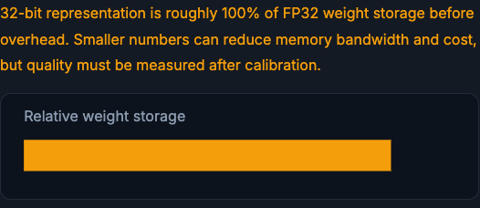
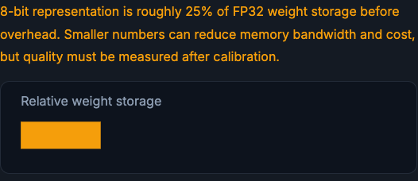

# Model Compression

Compression tries to make the model cheaper or faster while keeping enough quality for the product. This page covers the four levers, quantization, pruning, distillation, and low-rank factorization, and the shared warning that every one of them must be validated on real, production-like data.

!!! tip "Rapid Recall"
    Quantization stores weights or activations in fewer bits (FP16/BF16, INT8, INT4), reducing memory and bandwidth and sometimes speeding inference, at the risk of quality loss from rounding and outliers. Pruning removes parts of the model: unstructured prunes individual weights, structured prunes whole channels or heads and is easier for hardware to exploit. Distillation trains a smaller student to imitate a larger teacher from soft outputs. Low-rank factorization replaces a big matrix with two smaller ones, like PCA/SVD on redundant structure. Every technique needs real validation: the slider intuition is not accuracy, which depends on architecture, calibration data, activation outliers, kernels, and task sensitivity.

## §1 Quantization

Quantization stores weights or activations with fewer bits. FP32 uses 32-bit floating point numbers. FP16/BF16 use 16-bit. INT8 and INT4 use smaller integer-like representations. Smaller numbers reduce memory and bandwidth. On hardware with optimized kernels, they can also speed inference. The danger is quality loss from rounding and outliers. Always evaluate quantized models on real validation and production-like slices.

The intuition is just relative storage: a representation at `b` bits is roughly `b/32` of FP32 weight storage before overhead. FP32 is the full bar; INT8 is about a quarter of it.

<figure class="diagram diagram-dark" markdown="1">
  
  <figcaption>FP32 (32-bit) is the full-storage baseline: 100% of weight storage before overhead.</figcaption>
</figure>

<figure class="diagram diagram-dark" markdown="1">
  
  <figcaption>INT8 (8-bit) is roughly a quarter of FP32 weight storage, cutting memory and bandwidth.</figcaption>
</figure>

## §2 Pruning

Pruning removes parts of the model. Unstructured pruning removes individual weights, creating sparsity. Structured pruning removes whole channels, heads, neurons, or blocks. Structured pruning is easier for hardware to exploit. The risk is losing behavior that only appears on rare examples.

## §3 Distillation

Knowledge distillation trains a smaller student model to imitate a larger teacher. The student learns from soft probabilities or outputs, not just hard labels. It is useful when the teacher is too expensive for production. The risk is that the student inherits teacher mistakes and may smooth away rare but important behavior.

## §4 Low-rank factorization

Low-rank factorization replaces a large matrix with two smaller matrices. The intuition is the same as PCA/SVD: many transformations have redundant structure. This can reduce parameters and compute, but rank must be high enough to preserve task quality.

!!! warning "Important"
    The storage intuition above is only intuition. Real accuracy depends on architecture, calibration data, activation outliers, kernels, and task sensitivity. Always measure quality after compression on production-like slices.

## Interview Questions

**Q1: What does quantization trade, and what must you always do after it?**
It trades numeric precision for smaller, faster models: fewer bits per weight or activation cut memory and bandwidth and can speed inference on optimized kernels, at the risk of quality loss from rounding and outliers. Because the loss depends on architecture, calibration data, and activation outliers, you must always evaluate the quantized model on real validation and production-like slices, not assume the bit count tells you accuracy.

**Q2: What is the difference between structured and unstructured pruning?**
Unstructured pruning removes individual weights, creating sparsity that hardware does not always exploit efficiently. Structured pruning removes whole channels, heads, neurons, or blocks, which is easier for hardware to speed up. Both risk losing behavior that only shows up on rare examples, so the savings must be weighed against tail-case quality.

**Q3: When would you reach for distillation, and what is the risk?**
When a large teacher model is too expensive to serve, you train a smaller student to imitate it from soft probabilities or outputs rather than hard labels. The risk is that the student inherits the teacher's mistakes and may smooth away rare but important behavior, so the student needs its own evaluation on the cases that matter.

**Q4: What is low-rank factorization, intuitively?**
Replacing a large matrix with the product of two smaller ones, exploiting the same redundancy idea as PCA or SVD: many transformations have low-rank structure. It reduces parameters and compute, but the chosen rank must be high enough to preserve task quality, or you trade away accuracy for the savings.
