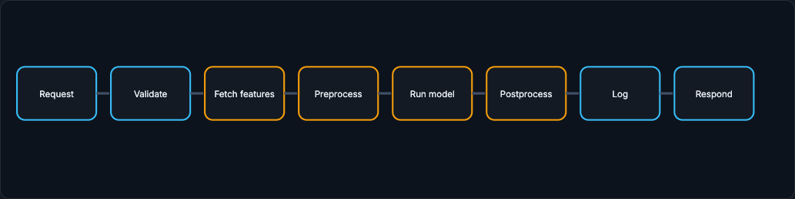

# Serving the Model

Serving is the part of an ML system where a trained artifact becomes a live decision. A model file sitting in a registry does nothing for users. Serving is everything required to turn a request into a prediction under real latency, reliability, cost, and correctness constraints. This section builds it step by step, starting from what must happen when a user asks for a prediction.

!!! tip "Rapid Recall"
    A prediction is not just a function call; it is a small production workflow that happens while something is waiting. The serving path is: receive request, validate, fetch features or context, preprocess into the exact tensor layout, run inference, postprocess into a product decision, return the response, and log evidence so the monitoring loop can evaluate later. The easiest beginner mistake is to benchmark only the model function: in real serving, feature lookup, preprocessing, queueing, cold starts, serialization, and downstream calls can dominate latency.

## Running Example: Fraud Decision at Checkout

A user clicks **Pay**. The product must decide whether to approve, decline, or send the transaction to manual review. The decision cannot take seconds because the checkout page is waiting. The model needs request fields, online features, and a model artifact. The system must return quickly, log enough evidence for later labels, and fail safely if something breaks.

This example is intentionally simple enough to understand but realistic enough to expose the actual serving tradeoffs: freshness, p99 latency, feature lookup, fallback, model versioning, and monitoring.

## §1 What actually happens when a model serves a prediction?

A prediction is not just a function call. It is a small production workflow that happens while a user, another service, or a batch job is waiting.

Imagine the fraud model as a Python function: `predict(transaction)`. In a notebook, you pass a pandas row and get a score. In production, there is no pandas row already waiting. The serving system must construct the input from live request data and other systems. It must also handle bad inputs, missing features, timeouts, logging, versioning, and fallback.

The serving path usually looks like this:

1. **Receive request.** A client or product service sends transaction id, user id, amount, country, payment method, device id, and request metadata.
2. **Validate request.** The server checks required fields, types, ranges, auth, tenant, request size, and whether the caller is allowed to use this model.
3. **Fetch features or context.** The server retrieves current user features, device risk, velocity counters, embeddings, documents, or other context. For fraud, this may mean failed logins in the last 10 minutes and number of cards used today.
4. **Preprocess.** The server transforms raw fields into the exact tensor/vector layout the model expects: numeric scaling, categorical encoding, tokenization, missing-value treatment, image resizing, or feature ordering.
5. **Run inference.** The runtime executes the model artifact on CPU, GPU, TPU, mobile accelerator, or browser runtime.
6. **Postprocess.** The raw output becomes a product decision: score calibration, thresholding, business rules, safety filters, explanation codes, or ranking constraints.
7. **Return response.** The product receives approve/decline/review plus score, model version, and maybe reason codes.
8. **Log evidence.** The system logs request id, model version, feature references, prediction, decision, latency, and outcome join keys so the [Production Loop](../loop/index.md) monitoring can evaluate later.

<figure class="diagram diagram-dark" markdown="1">
  
  <figcaption>The serving path: request, validate, fetch features, preprocess, run model, postprocess, log, respond.</figcaption>
</figure>

The easiest beginner mistake is to benchmark only the model function. In real serving, the model may be only one part of latency. Feature lookup, preprocessing, queueing, cold starts, serialization, and downstream calls can dominate.

## Where to go next

- [Serving Modes](modes.md) on batch, online, streaming, async, and edge.
- [Online Path and Latency](online-path-latency.md) on the online architecture and latency budget.
- [Batching and Caching](batching-caching.md) on the throughput-latency tradeoff and safe caching.
- [Model Compression](compression.md) on quantization, pruning, distillation, and low-rank.
- [LLM Serving](llm-serving.md) on prefill, decode, KV cache, and continuous batching.
- [Runtimes and Failures](runtimes-failures.md) on 2026 runtimes, edge, and fallback policy.

## Interview Questions

**Q1: Walk through what happens when a model serves a single prediction.**
The server receives the request, validates fields and auth, fetches online features and context, preprocesses raw fields into the exact tensor layout the model expects, runs inference, postprocesses the output into a product decision with thresholds and rules, returns the response with model version, and logs evidence (request id, features, prediction, latency, join keys) so monitoring can evaluate it once labels arrive.

**Q2: Why is "our model inference is 20 ms" a weak serving answer?**
Because the model function is only one part of the path. In production there is no pandas row waiting: the server has to construct the input from live request data and other systems, so feature lookup, preprocessing, queueing, cold starts, serialization, and downstream calls can dominate end-to-end latency. The honest number is the end-to-end p95/p99, not the isolated inference time.

**Q3: Why does the serving system log evidence on every prediction?**
Because labels arrive later, so you must record request id, model version, feature references, the prediction and decision, latency, and outcome join keys at serving time. Without that evidence the monitoring loop cannot join predictions to eventual outcomes to evaluate the model, detect drift, or debug a specific bad decision.
