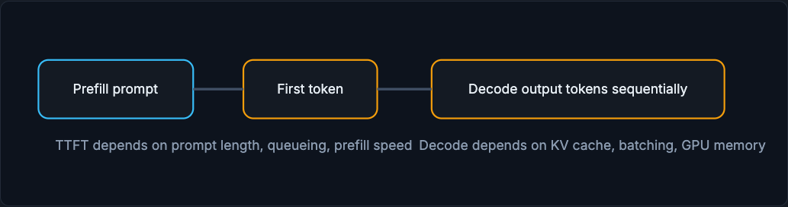

# LLM Serving From First Principles

LLM serving is different because the model does not return one score. It generates tokens one at a time while holding memory for every active sequence. That single fact, autoregressive generation with growing memory, explains prefill, decode, the KV cache, paged attention, and continuous batching.

!!! tip "Rapid Recall"
    Prefill processes all input tokens at once; the delay until the first output token is TTFT. Decode then generates tokens one at a time, each depending on the previous, measured in tokens per second. The KV cache stores key/value tensors from previous tokens so generation does not recompute them, and it grows with context length and active sequences, which is why memory pressure is central. Paged attention manages the KV cache in blocks to cut fragmentation and fit more concurrent requests, and continuous batching lets new requests join as old sequences finish. Speculative decoding uses a small draft model to propose tokens a large model verifies: a performance technique, not a quality guarantee.

## §1 Prefill

When a prompt arrives, the model processes all input tokens. This is the prefill phase. A long prompt costs more prefill time. The time until the first output token is called TTFT, time to first token. Users feel TTFT as "how long before the assistant starts responding."

## §2 Decode

After prefill, the model generates one token, then another, then another. Each new token depends on previous tokens. This is the decode phase. Decode performance is measured in tokens per second or inter-token latency. A request asking for 50 output tokens is very different from one asking for 5,000.

<figure class="diagram diagram-dark" markdown="1">
  
  <figcaption>Prefill processes the prompt and produces the first token (TTFT); decode then generates tokens sequentially.</figcaption>
</figure>

## §3 KV cache

Transformers use attention over previous tokens. Recomputing all previous states for every new token would be wasteful. The KV cache stores key/value tensors from previous tokens so generation can continue efficiently. The cache grows with context length and number of active sequences. This is why memory pressure is central in LLM serving.

## §4 Paged attention and continuous batching

Paged attention manages KV cache in blocks, reducing fragmentation and allowing more concurrent requests. Continuous batching lets new requests join as old sequences finish, improving GPU utilization. These ideas are why vLLM, TensorRT-LLM, SGLang, and related runtimes matter.

## §5 Speculative decoding

Speculative decoding uses a smaller draft model to propose tokens, then a larger model verifies them. If many draft tokens are accepted, output speeds up. If not, the benefit shrinks. This is a performance technique, not a quality guarantee.

## §6 LLM serving metrics

| Metric | Meaning | Why it matters |
|---|---|---|
| TTFT | Time to first token | User-perceived startup delay |
| Tokens/sec | Decode throughput | How fast response streams |
| Queue time | Waiting before compute | Signals overload |
| KV cache memory | Memory for active sequences | Limits concurrency |
| Cost per 1k tokens | Unit economics | Controls product viability |

## Interview Questions

**Q1: Why is serving an LLM fundamentally different from serving a classifier?**
Because the LLM does not return one score; it generates tokens one at a time autoregressively while holding memory for every active sequence. That produces two distinct phases, prefill and decode, makes time-to-first-token and tokens-per-second the key latency signals, and turns KV-cache memory into the central constraint, none of which exist for a single-shot classifier.

**Q2: What is the KV cache and why does it dominate LLM serving memory?**
Transformers attend over all previous tokens, and recomputing their key/value tensors for every new token would be wasteful, so the KV cache stores them to continue generation efficiently. It grows with context length and the number of active sequences, so memory pressure, not raw compute, often limits how many requests you can serve concurrently.

**Q3: What problem do paged attention and continuous batching solve?**
Paged attention manages the KV cache in blocks to reduce fragmentation, letting more sequences fit and run concurrently. Continuous batching lets new requests join the batch as old sequences finish instead of waiting for the slowest one, keeping the GPU busy during token generation. Together they raise utilization, which is why vLLM, TensorRT-LLM, and SGLang matter.

**Q4: What is speculative decoding, and is it a quality improvement?**
A small draft model proposes several tokens that the large model then verifies in one step; if many proposals are accepted, generation speeds up, and if few are accepted, the benefit shrinks. It is purely a performance technique to reduce latency, not a guarantee of better output quality, since the large model still decides the final tokens.
