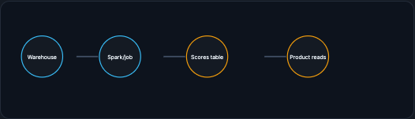
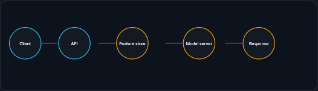
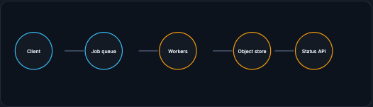
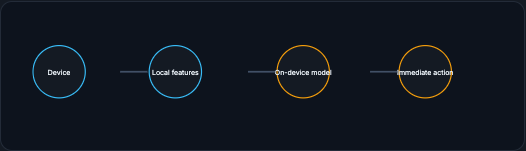

# Serving Modes

The first architecture decision is when the prediction must be available. That determines almost everything else. This page walks the five modes, batch, online, streaming, async, and edge, and the freshness-and-latency rule that picks between them.

!!! tip "Rapid Recall"
    Choose the serving mode from freshness and latency. Batch scores many examples ahead of time and stores them: cheap and high-throughput, but stale. Online runs during a live request: fresh, but p99 latency and fallback dominate the design. Streaming runs as events arrive, updating a current picture of the world. Async puts slow work on a queue and returns a job id for later. Edge runs on the device for privacy, offline use, or ultra-low latency, at the cost of harder updates and monitoring. If hours-old is acceptable, batch; if the decision depends on current request context, online; if work is slow and the user can wait, async; if offline, privacy, or ultra-low latency dominates, edge.

## §1 Batch prediction

Batch prediction means you score many examples ahead of time and store the results. Example: every night, compute churn risk for all users and write a table `user_id -> churn_score`. The product reads the stored score later. Batch is efficient because you can use large jobs, scan files sequentially, and avoid strict per-request latency. The cost is staleness. If the user's behavior changes after the batch job, the score may be outdated.

<figure class="diagram diagram-dark" markdown="1">
  
  <figcaption>Batch: a job scores rows ahead of time into a table the product reads later. Cheap and high-throughput, but stale.</figcaption>
</figure>

## §2 Online prediction

Online prediction means the model runs during a live request. Fraud checkout, ad ranking, search ranking, and personalized recommendations often need this because the latest context matters. Online serving must optimize p95/p99 latency, uptime, feature lookup speed, autoscaling, timeouts, and fallback.

<figure class="diagram diagram-dark" markdown="1">
  
  <figcaption>Online: the model runs inside the request. Fresh, but p99 latency and fallback dominate the design.</figcaption>
</figure>

## §3 Streaming inference

Streaming inference runs as events arrive. It is not necessarily tied to a user waiting on a web page. A stream processor might classify transactions as they flow through Kafka, update a risk state, or trigger alerts. Streaming is useful when each event updates the current picture of the world.

## §4 Async inference

Async inference is for slow work where the user can wait later: video transcription, document extraction, image generation, large embedding jobs. The user submits a job, the system places it on a queue, workers process it, and the user polls or receives a callback.

<figure class="diagram diagram-dark" markdown="1">
  
  <figcaption>Async: slow work goes on a queue; the user gets a job id and retrieves results later.</figcaption>
</figure>

## §5 Edge inference

Edge inference runs on the device: phone, browser, camera, car, laptop, or embedded device. It reduces network latency and can preserve privacy, but you lose easy central control. Updating models, monitoring quality, and supporting many device types become harder.

<figure class="diagram diagram-dark" markdown="1">
  
  <figcaption>Edge: inference runs locally for privacy, offline use, or ultra-low latency; updates and monitoring are harder.</figcaption>
</figure>

!!! note "Interview rule"
    Choose serving mode from freshness and latency. If hours-old is acceptable, batch. If the decision depends on current request context, online. If work is slow and user can wait, async. If offline/privacy/ultra-low latency dominates, edge.

## Interview Questions

**Q1: How do you choose a serving mode?**
From freshness and latency. If an hours-old prediction is acceptable, batch it ahead of time. If the decision depends on the current request context, serve online. If the work is slow but the user can wait, go async with a queue and a job id. If offline operation, privacy, or ultra-low latency dominates, run at the edge. The product's freshness and latency needs decide almost everything else.

**Q2: What is the core tradeoff of batch versus online serving?**
Batch is cheap and high-throughput because it scores many rows in large sequential jobs without per-request latency pressure, but the stored scores go stale as behavior changes. Online is fresh because the model runs inside the live request, but it must optimize p95/p99 latency, uptime, feature lookup speed, autoscaling, timeouts, and fallback.

**Q3: When is async inference the right pattern, and how does it work?**
For slow work the user does not need immediately: video transcription, document extraction, image generation, large embedding jobs. The user submits a job, the system enqueues it, workers process it asynchronously, and the user polls or receives a callback when results are ready, rather than blocking on a synchronous response.

**Q4: What do you give up by serving at the edge?**
Central control. Edge inference cuts network latency and can preserve privacy by running on the device, but updating models, monitoring quality, and supporting diverse devices all get harder, and observability is weak. You trade easy central management for locality, offline operation, and privacy.
