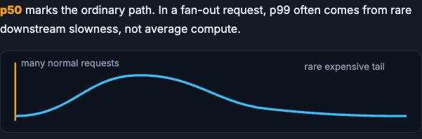
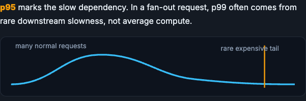
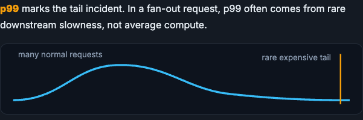

# Latency, Tail Behavior, and Capacity

Average latency is seductive and often useless. This page is about the tail, the p95 and p99 that users actually feel, and the small amount of capacity math that turns a vague design into a defensible one.

!!! tip "Rapid Recall"
    If a request fans out to several dependencies, users feel the slowest pieces, which is why design conversations focus on p95 and p99 rather than the average. The tail is where overload, retries, locks, cold starts, network jitter, and noisy neighbors show up. Capacity math is mostly about the read path: database reads after cache equal QPS times one minus the hit rate, so the cache hit rate is an architecture variable, not a detail. Retries can raise success rate while making tail latency and downstream overload worse, so they need timeouts, jittered backoff, max attempts, and idempotency keys.

## §1 Why the tail dominates

Average latency is seductive and often useless. If a request fans out to several dependencies, users feel the slowest pieces. That is why system design conversations focus on p95 and p99: the tail is where overload, retries, locks, cold starts, network jitter, and noisy neighbors show up.

The percentile you quote changes the story. A low percentile traces the ordinary path; as you move toward p99 you are describing slow dependencies, retry or queueing effects, and finally rare tail incidents. In a fan-out request, p99 often comes from rare downstream slowness, not average compute.

<figure class="diagram diagram-dark" markdown="1">
  
  <figcaption>p50 marks the ordinary path: most requests sit in the fast bulk of the distribution.</figcaption>
</figure>

<figure class="diagram diagram-dark" markdown="1">
  
  <figcaption>p95 marks slow dependencies starting to show in the tail.</figcaption>
</figure>

<figure class="diagram diagram-dark" markdown="1">
  
  <figcaption>p99 marks the rare expensive tail, where retries, queueing, and incidents live.</figcaption>
</figure>

## §2 Capacity estimation

You do not need perfect math; you need numbers that expose whether one database is enough. The key relationship for a read-heavy service is simple: the database only sees the reads the cache misses. If total read QPS is `Q` and the cache hit rate is `h`, then database reads after cache are `Q * (1 - h)`. Divide by the read capacity per replica `c` and round up to get the number of read replicas needed, plus headroom.

This is why cache hit rate is an architecture variable, not a detail. The same traffic needs very different infrastructure depending on how well the cache absorbs reads.

| Total QPS | Cache hit rate | DB reads after cache | Reads/sec per replica | Read replicas needed |
|---|---|---|---|---|
| 10,000 | 90% | 1,000 | 2,500 | 1 |
| 10,000 | 50% | 5,000 | 2,500 | 2 |
| 10,000 | 20% | 8,000 | 2,500 | 4 |
| 50,000 | 90% | 5,000 | 2,500 | 2 |
| 50,000 | 95% | 2,500 | 2,500 | 1 |

The jump from a 90% to a 50% hit rate quintuples the database load on the same traffic. A few points of hit rate is the difference between one replica and a sharded fleet.

!!! warning "Common trap"
    Retries can improve success rate while making tail latency and downstream overload worse. In production, retries need timeouts, jittered exponential backoff, max attempts, and idempotency keys for writes.

## Interview Questions

**Q1: Why report p99 latency instead of the average?**
Because users in a fan-out request feel the slowest dependency, and the average hides that. A service with a fine average can still have a painful p99 where overload, retries, locks, cold starts, network jitter, and noisy neighbors show up. SLAs are written on p95 or p99 precisely because the tail is what cascades into timeouts and failures.

**Q2: How do you estimate how many database replicas a read-heavy service needs?**
Compute database reads after cache as total QPS times one minus the cache hit rate, then divide by the read capacity per replica and round up, leaving headroom. This shows that the cache hit rate is an architecture variable: at 90% hit rate the database sees a tenth of the reads, while at 20% it sees most of them.

**Q3: Why can adding retries make things worse?**
Retries raise the success rate of individual calls but amplify load exactly when a dependency is already slow, pushing tail latency up and risking a retry storm that overloads the downstream further. Safe retries require timeouts, jittered exponential backoff, a max-attempts cap, and idempotency keys so retried writes do not double-apply.
