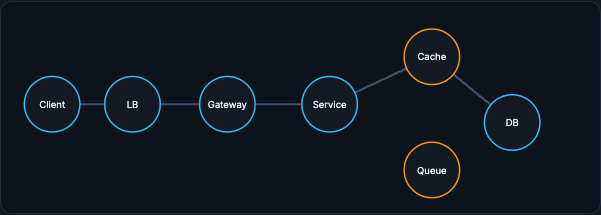
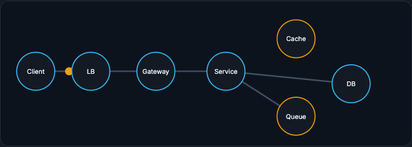

# The Standard Request Path

A user request usually crosses several boundaries before data returns. Each boundary exists for a reason, and learning to narrate that journey, including what happens on a cache hit, a cache miss, and an asynchronous side effect, is the backbone of every high-level design you will draw.

!!! tip "Rapid Recall"
    A request crosses boundaries for global proximity, traffic distribution, policy enforcement, business logic, fast repeated reads, durable state, asynchronous work, and observability. On a cache hit the request avoids the database, so latency and load stay low, at the risk of staleness. On a cache miss the service pays the database cost and backfills the cache, at the risk of a stampede. Async side effects return the user response after the durable write while analytics, email, or ML logging flow through a queue. The ML extension adds a feature store, vector database, or model server before the response, which adds latency and quality failure modes.

## §1 Why each boundary exists

A user request usually crosses several boundaries before data returns. Each boundary exists for a reason: global proximity, traffic distribution, policy enforcement, business logic, fast repeated reads, durable state, asynchronous work, and observability.

## §2 Three request shapes

The same skeleton (Client, load balancer, gateway, service, cache, database, queue) behaves differently depending on whether the data is cached, missing, or written asynchronously. The amber nodes mark where ML systems later attach a cache, feature store, or queue.

### Cache hit

The request avoids the database, so latency and backend load stay low. The risk is staleness if invalidation is wrong.

<figure class="diagram diagram-dark" markdown="1">
  
  <figcaption>Cache hit: the service reads from the cache and returns without touching the database.</figcaption>
</figure>

### Cache miss

The service pays the database cost, returns the result, and backfills cache. The risk is stampede if many clients miss at once.

<figure class="diagram diagram-dark" markdown="1">
  
  <figcaption>Cache miss: the service falls through to the database, returns the result, and backfills the cache.</figcaption>
</figure>

### Async side effect

The user response returns after the durable write, while analytics, email, or ML logging happens through a queue.

<figure class="diagram diagram-dark" markdown="1">
  
  <figcaption>Async side effect: the user-facing path returns after the durable write; slow work is handed to a queue.</figcaption>
</figure>

## §3 What the boxes mean

**Load balancer:** spreads traffic across healthy replicas and removes dead ones from rotation.

**API gateway:** applies cross-cutting policy such as auth, rate limits, request size limits, and routing.

**Cache:** reduces read latency and database load when data is repeated or expensive to compute.

**Queue:** protects the user-facing path from slow or bursty downstream work.

!!! note "Interview note"
    ML extension: later, the service often calls a feature store, vector database, or model server before responding. That adds new latency and quality failure modes. The [Serving the Model](../serving/index.md) section revisits this exact path with the model server in place.

## Interview Questions

**Q1: Walk me through a standard request path and why each hop exists.**
A request crosses boundaries for global proximity (CDN), traffic distribution (load balancer), policy enforcement (gateway), business logic (service), fast repeated reads (cache), durable state (database), asynchronous work (queue), and observability events. The boxes matter less than the flows: synchronous request/response, asynchronous side effects, storage writes, cache lookups, and observability.

**Q2: What is the difference between a cache hit and a cache miss in this path?**
On a hit the request avoids the database, so latency and backend load stay low, with the risk of serving stale data if invalidation is wrong. On a miss the service pays the database cost, returns the result, and backfills the cache, with the risk of a stampede if many clients miss the same hot key at once.

**Q3: Why route side effects through a queue instead of doing them inline?**
So the user-facing path returns after the critical durable write while analytics, email, and ML logging happen asynchronously. This protects the user from slow or bursty downstream work and lets those consumers scale independently.

**Q4: How does this path change for an ML service?**
The service often calls a feature store, vector database, or model server before responding. That adds new latency budget to manage and new quality failure modes, since the model can return a worse answer while every infrastructure signal looks healthy.
