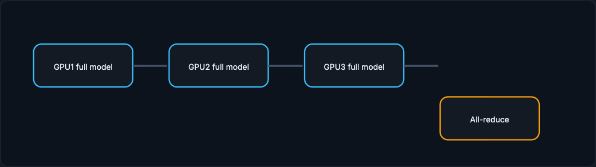
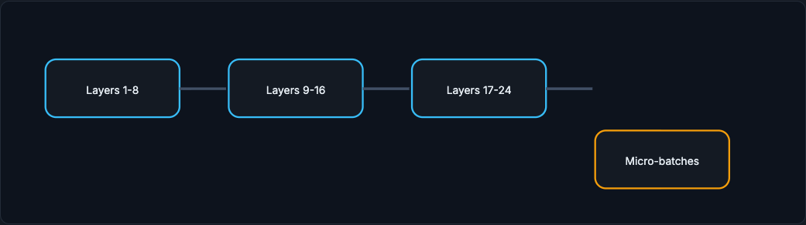
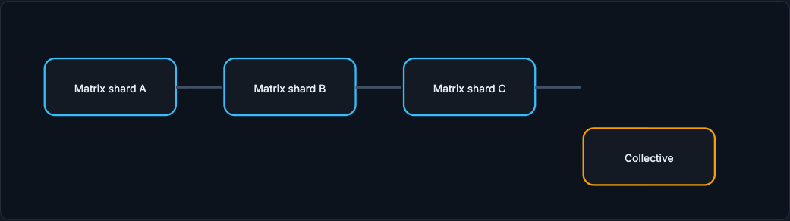

# Distributed Training

Distributed training is not "more GPUs is faster." It is a trade between computation, memory, and communication. This page walks the three parallelism modes and the supporting techniques (gradient accumulation, mixed precision, checkpointing) that keep a long job alive and correct.

!!! tip "Rapid Recall"
    Data parallelism is the easy starting point: every GPU holds the full model, each gets a different batch shard, and gradients are averaged with all-reduce before one shared optimizer step, at the cost of communication every step. Gradient accumulation simulates a larger batch under memory limits without reducing compute. Mixed precision uses FP16, BF16, or FP8 where safe to save memory and speed compute, with care for instability. Model parallelism is for models that do not fit on one device: pipeline parallelism splits layers into stages (with pipeline bubbles), tensor parallelism splits a single large operation across GPUs (with communication inside layers). Checkpointing is survival: save weights, optimizer state, and scheduler state so a failed run resumes as the same training process.

## §1 Data parallelism

Data parallelism is the easiest starting point. Copy the same model onto multiple GPUs. Split each batch across GPUs. Each GPU computes gradients on its mini-batch shard. Then GPUs average gradients using an operation called all-reduce. After that, every replica applies the same update. The benefit is faster processing of large batches. The cost is communication every step.

<figure class="diagram diagram-dark" markdown="1">
  
  <figcaption>Data parallelism: every GPU has the full model on different examples; gradients meet at all-reduce.</figcaption>
</figure>

**Gradient accumulation** is related but simpler: you process several smaller mini-batches before taking an optimizer step. It simulates a larger batch when memory is limited, but it does not reduce total compute.

**Mixed precision** uses lower-precision numeric formats such as FP16, BF16, or FP8 where safe. It saves memory and speeds compute, but needs care to avoid numerical instability.

## §2 Model parallelism

Model parallelism is used when the model does not fit on one device. Pipeline parallelism splits layers into stages. Tensor parallelism splits large tensor operations across devices. These are common for large transformers, but communication patterns become central. A poor split can spend more time moving activations than computing.

### Pipeline parallelism

Pipeline parallelism: different layers live on different GPUs. Micro-batches flow through stages. It helps memory but introduces pipeline bubbles.

<figure class="diagram diagram-dark" markdown="1">
  
  <figcaption>Pipeline parallelism: layer stages on different GPUs; micro-batches flow through, leaving pipeline bubbles.</figcaption>
</figure>

### Tensor parallelism

Tensor parallelism: one large operation is split across GPUs. It enables huge transformer layers, but communication happens inside layers and must be very fast.

<figure class="diagram diagram-dark" markdown="1">
  
  <figcaption>Tensor parallelism: a single large operation is sharded across GPUs, with communication inside the layer.</figcaption>
</figure>

## §3 Checkpointing

Checkpointing is survival. Long training jobs fail. A useful checkpoint contains model weights, optimizer state, scheduler state, and enough training progress to resume. If you resume only weights but not optimizer state, the run is no longer the same training process.

## Interview Questions

**Q1: Explain data parallelism and its main cost.**
Every GPU holds a full copy of the model, each processes a different shard of the batch and computes gradients, then all-reduce averages those gradients so every replica applies the same update. It speeds up processing large batches, but the cost is communication on every step to perform the all-reduce.

**Q2: When do you need model parallelism instead of data parallelism?**
When the model does not fit on a single device. Pipeline parallelism splits the layers into stages across GPUs; tensor parallelism splits a single large tensor operation across GPUs. Both are common for large transformers, and both make the communication pattern central, since a poor split can spend more time moving activations than computing.

**Q3: What is the difference between gradient accumulation and data parallelism?**
Gradient accumulation processes several smaller mini-batches and only steps the optimizer after them, simulating a larger batch when memory is limited, but it does not reduce total compute and uses one device. Data parallelism actually spreads the batch across multiple GPUs to process it faster, paying communication cost to synchronize gradients.

**Q4: Why must a checkpoint include optimizer state, not just weights?**
Because resuming from weights alone restarts the optimizer's momentum, learning-rate schedule, and accumulated state, so the continued run is no longer the same training process. A useful checkpoint stores model weights, optimizer state, scheduler state, and enough progress to resume the identical trajectory after a failure.
