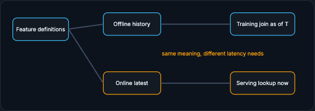

# Feature Stores and LLMs

A feature store exists because the same feature must mean the same thing during training and serving. This page covers that parity problem and then the post-training reality for LLMs, where "training in production" usually means fine-tuning and evaluation rather than pretraining from scratch.

!!! tip "Rapid Recall"
    Without a feature store, a feature computed in a training notebook and reimplemented in a serving API can quietly diverge (one counts OTP failures, the other does not; one uses event time, the other processing time), so the model sees inconsistent meaning. A feature store organizes feature definitions, an offline store for historical training data, and an online store for low-latency serving, with materialization jobs moving values between them. Point-in-time correctness is the hardest part: a training join must use the value known at time T, not today's value. For LLMs, production training usually means supervised fine-tuning, LoRA/QLoRA adapters, and preference tuning; the same principles apply but artifacts multiply and contamination (eval examples leaking into training) is a major risk.

## §1 Why a feature store exists

A feature store exists because the same feature must mean the same thing during training and serving.

Without a feature store, data scientists may compute `failed_logins_last_10_min` in a notebook using historical events, while production engineers implement a similar but not identical computation in an API service. One version includes only password failures; the other includes OTP failures. One uses event time; the other uses processing time. The model now sees inconsistent meaning.

A feature store organizes feature definitions, offline historical values, and online low-latency values. The **offline store** is used to build training data over history, usually from warehouse or lakehouse tables. The **online store** is used at request time, usually a key-value system optimized for p99 latency. Materialization jobs move values from computation pipelines into the online store.

Point-in-time correctness is the hardest concept. When training an example at time T, the feature join must use the value that was known at time T. If it joins the latest value today, the training set sees the future. Feature stores such as Feast, Tecton, Databricks Feature Store, Vertex AI Feature Store, and SageMaker Feature Store exist to reduce this risk, though they make different tradeoffs around managed pipelines, cloud integration, and operational burden.

<figure class="diagram diagram-dark" markdown="1">
  
  <figcaption>One definition, two stores: offline history for point-in-time training joins, online latest for low-latency serving.</figcaption>
</figure>

!!! note "Interview phrasing"
    "I would define features once, use the offline store for point-in-time training data, materialize fresh values to an online store for serving, and monitor freshness plus offline/online parity."

## §2 LLM and Post-Training Reality

For LLMs, "training in production" often means post-training and evaluation pipelines rather than pretraining from scratch.

Most companies do not pretrain foundation models. They fine-tune, adapt, evaluate, and serve existing models. Supervised fine-tuning teaches a model from curated prompt-response examples. LoRA and QLoRA adapt a model with small trainable adapters instead of updating all weights. Preference tuning uses comparisons or reward signals to make outputs align better with user preferences.

The same production principles apply, but the artifacts multiply. You need prompt datasets, conversation logs, safety labels, evaluation suites, judge prompts, adapter versions, base model versions, tokenizer versions, and inference settings. Contamination is a major risk: if evaluation examples leak into training data, the model appears better than it is.

LLM evaluation is also less settled than classic tabular ML. You may need unit-style golden tests, human review, LLM-as-judge with calibration, regression suites, tool-call success rates, refusal behavior, hallucination checks, toxicity checks, latency, and cost per task. The training pipeline must capture these evaluations because a lower loss does not guarantee a better product model.

## §3 Interview Synthesis

A strong answer treats training as a governed production workflow, not a notebook experiment.

> "I would build a reproducible training pipeline: pin a data snapshot, validate schema and distributions, generate point-in-time correct features, train baseline and candidate models, log every run with code/data/feature/model versions, evaluate global and slice metrics plus latency and cost, register the artifact, and promote only through controlled gates. For distributed training, I would only introduce it if model size or training time requires it, and I would account for communication and checkpointing."

## Interview Questions

**Q1: What problem does a feature store solve?**
Training-serving skew from divergent feature implementations. The same feature computed in a training notebook and reimplemented in a serving API can quietly differ in what events it counts or whether it uses event versus processing time, so the model sees inconsistent meaning. A feature store defines features once and serves them to both an offline store for training and an online store for serving.

**Q2: What is point-in-time correctness in a feature store, and why is it the hardest part?**
When building a training example at time T, the join must use the feature value that was known at T, not the latest value today. Using today's value lets the training set see the future, inflating offline metrics and creating leakage. Getting the as-of-T join right across many features and entities is the core difficulty feature stores exist to manage.

**Q3: What does "training in production" usually mean for LLMs?**
Post-training, not pretraining: most companies fine-tune, adapt, evaluate, and serve existing models via supervised fine-tuning, LoRA or QLoRA adapters, and preference tuning. The same production discipline applies, but the artifacts multiply (prompt datasets, adapters, base and tokenizer versions, eval suites) and contamination, where eval examples leak into training, is a major risk.

**Q4: Why can't you trust a lower loss as proof of a better LLM?**
Because LLM quality is multi-dimensional and less settled than tabular ML: a model with lower loss can still hallucinate more, refuse incorrectly, fail tool calls, or regress on golden tests. You need task-specific evals, human review, calibrated LLM-as-judge, regression suites, and safety checks, all captured by the pipeline, because loss does not guarantee a better product model.
