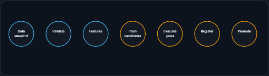

# Training in Production

Production training is the discipline of turning a data snapshot and code version into a model artifact that can be reproduced, evaluated, approved, deployed, monitored, and rolled back. In a notebook you can run cells until a metric looks good. In production that is not enough: the company needs to know which data produced the model, whether it beats the current one, whether it is safe on important slices, whether it serves within latency and cost limits, and how to recover if it fails.

!!! tip "Rapid Recall"
    A training pipeline is a controlled assembly line whose job is not just to produce a model but to produce evidence that the model should or should not be trusted. The stages: pin a data snapshot (so today's and tomorrow's models are comparable), validate inputs before spending GPU hours, generate features while recording which definitions were used, train candidates, evaluate against offline metrics, slices, calibration, latency, and the current production model, register the artifact with metadata, and promote only if gates pass. A notebook is for exploration; a pipeline is for repeatability. If you cannot rerun it, inspect it, and explain its inputs and outputs, it is not production training.

## Running Scenario: Fraud Model Candidate

Continue the fraud system from [ML Data Foundations](../data/index.md). You now have point-in-time correct training rows. You want to train a new model that reduces fraud losses without blocking too many good customers. The current production model is a gradient-boosted tree. A new candidate improves global AUC, but it is slower and regresses users from one country. Should it ship? This section teaches how production training answers that question.

## §1 Training Pipeline Anatomy

A training pipeline is a controlled assembly line. Its job is not just to produce a model; it is to produce evidence that the model should or should not be trusted.

The pipeline usually starts by selecting a data snapshot. This matters because training data changes. New labels arrive, bad rows are corrected, privacy deletions happen, and features are backfilled. If you do not pin the input data, a model trained today may not be comparable to a model trained tomorrow.

Next comes validation. Before spending GPU hours or producing a model, the pipeline should ask: are required columns present, are types correct, did null rates explode, did distributions shift unexpectedly, are label windows complete, are point-in-time joins valid, and are duplicates under control?

Feature generation turns raw and curated data into model inputs. For fraud, this might include account age, transaction amount, device risk score, payment velocity, failed-login counts, and historical spend. The pipeline must record which feature definitions were used. A model trained with feature definition v7 is not the same as one trained with v8.

Training produces one or more candidate artifacts. Evaluation compares them against offline metrics, slices, robustness checks, calibration, fairness constraints, latency, memory footprint, and the current production model. Registration stores the chosen artifact and its metadata. Promotion changes its stage only if gates pass.

<figure class="diagram diagram-dark" markdown="1">
  
  <figcaption>The training pipeline as a timeline: each stage produces evidence, ending in a governed promote step.</figcaption>
</figure>

!!! note "Interview note"
    Notebook vs pipeline: a notebook is good for exploration. A pipeline is for repeatability. If you cannot rerun it, inspect it, and explain its inputs and outputs, it is not production training.

## Where to go next

- [Baselines and Model Choice](baselines-models.md) on picking the simplest model that meets the requirements.
- [Tracking and Versioning](tracking-versioning.md) on run evidence, data versioning, and lineage.
- [Distributed Training](distributed.md) on data, pipeline, and tensor parallelism.
- [Evaluation Gates and CI/CD](evaluation-cicd.md) on multi-objective promotion.
- [Feature Stores and LLMs](feature-stores.md) on training-serving parity and post-training.

## Interview Questions

**Q1: What is the real job of a training pipeline?**
Not just to produce a model, but to produce evidence that the model should or should not be trusted. It pins a data snapshot, validates inputs, generates features while recording their definitions, trains and evaluates candidates against metrics, slices, latency, and the current production model, registers the artifact, and promotes only through gates. That evidence trail is what makes a training decision explainable later.

**Q2: Why pin a data snapshot?**
Because training data changes underneath you: new labels arrive, bad rows are corrected, privacy deletions happen, and features get backfilled. If the input is not pinned, a model trained today is not comparable to one trained tomorrow, so you cannot attribute a metric change to a code or model change rather than a silent data change.

**Q3: What should validation check before any GPU time is spent?**
Whether required columns are present and correctly typed, whether null rates exploded, whether distributions shifted unexpectedly, whether label windows are complete, whether point-in-time joins are valid, and whether duplicates are under control. Catching these before training avoids wasting compute on a run that was doomed by a data problem.
