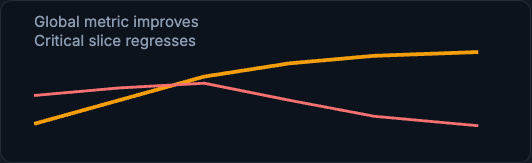
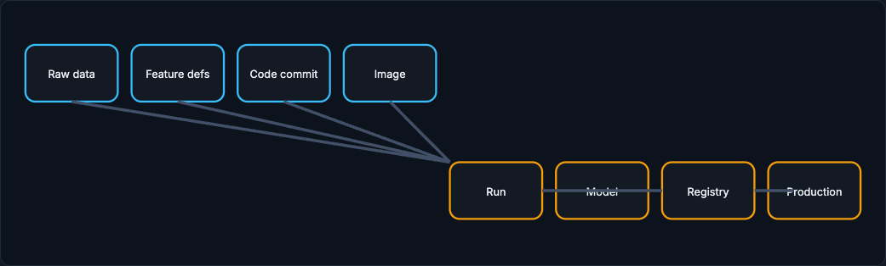

# Tracking and Versioning

Experiment tracking answers "what exactly did we try, and what happened?" Versioning answers "what produced this model, and can we reproduce it?" Together they make a training decision explainable months later, which is the whole point of production training.

!!! tip "Rapid Recall"
    A training run should log parameters, metrics, artifacts, data version, code version, feature version, environment, seed, hardware, timing, and owner, because someone will ask each question later. A model version is a bundle of evidence, not a file named model.pkl: it stores artifact plus schema, feature definitions, metrics, dependencies, approval status, and lineage back to the run. Production ML needs data versioning as well as code versioning, since data is large, mutable, and time-dependent. Reproducibility usually means controlled reproducibility (same data, code, config, environment, metrics within tolerance), not bit-identical weights. Production decisions are multi-objective: a candidate can improve global AUC while regressing a critical slice or blowing the latency budget.

## §1 Experiment Tracking

Experiment tracking is the system that answers: "What exactly did we try, and what happened?"

A training run should log parameters, metrics, artifacts, data version, code version, feature version, environment, random seed, hardware, start/end time, owner, and notes. Each of these exists because someone will ask a question later.

If a metric changed, parameters and code tell you what changed. If a model cannot be loaded, artifacts and environment explain why. If an auditor asks why a model was approved, metrics, evaluation reports, and registry stage history answer. If production regresses, the data and feature versions let you compare the new model with the old one.

MLflow and Weights & Biases are not magic. MLflow is often used for tracking, artifacts, model registry, and vendor-neutral lifecycle management. W&B is often used for rich experiment dashboards, sweeps, collaborative analysis, artifacts, and reports. The design principle is more important than the product: centralize run evidence so training decisions are explainable.

### Run comparison

| Run | Data | Model | AUC | Country B recall | p99 | Decision |
|---|---|---|---|---|---|---|
| r-101 | v41 | XGBoost | .879 | .74 | 12 ms | current prod |
| r-102 | v42 | XGBoost | .891 | .76 | 14 ms | candidate |
| r-103 | v42 | NN | .896 | .61 | 90 ms | reject |

<figure class="diagram diagram-dark" markdown="1">
  
  <figcaption>A global metric can improve while a critical slice regresses, which is why single numbers mislead.</figcaption>
</figure>

!!! warning "Trap"
    Why r-103 is rejected: global AUC improved, but a critical slice regressed and p99 latency is too high for checkout. Production decisions are multi-objective.

## §2 Versioning and Reproducibility

A model version is a bundle of evidence, not just a file named `model.pkl`.

Code versioning is familiar: Git records source changes. But production ML also needs data versioning. Data is large, mutable, and time-dependent. Labels arrive late. Backfills change history. A bug fix may rewrite a feature table. Privacy deletion may remove rows. Without data versioning, you cannot say what the model learned from.

Model versioning stores the trained artifact plus metadata: input schema, output schema, feature definitions, metrics, environment, dependencies, owner, approval status, and lineage back to the run. A model registry gives controlled stages such as development, staging, production, archived. Promotion is a governed transition, not somebody copying a file into a server folder.

Reproducibility does not always mean bit-identical weights. GPU kernels, distributed training, and nondeterminism can make exact reproduction hard. The practical goal is controlled reproducibility: same data snapshot, same code, same config, same environment, and metrics within expected tolerance.

Tools address different pieces. DVC can version data pointers and artifacts alongside Git. lakeFS can provide Git-like branches and commits over object storage. Delta/Iceberg/Hudi provide table snapshots. MLflow Registry stores model versions and stages. Containers pin runtime dependencies.

The full chain, from raw data and feature definitions through code, image, run, model, and registry to production, is what lineage records:

<figure class="diagram diagram-dark" markdown="1">
  
  <figcaption>Lineage links raw data, feature definitions, code, and image to the run, model, registry, and production.</figcaption>
</figure>

!!! note "Compliance angle"
    Privacy laws complicate reproducibility. If a user invokes deletion rights, future training must exclude that data. Some organizations also need lineage to know which derived datasets were affected. Reproducibility and deletion can conflict, so policy must define what is retained, deleted, retrained, or legally held.

## Interview Questions

**Q1: What should a training run log, and why?**
Parameters, metrics, artifacts, and the data, code, feature, and environment versions, plus seed, hardware, timing, and owner. Each exists because someone asks a question later: parameters and code explain a metric change, artifacts and environment explain a load failure, metrics and stage history justify an approval to an auditor, and data and feature versions let you compare a regressed model against the old one.

**Q2: Why is data versioning necessary on top of code versioning?**
Because data is large, mutable, and time-dependent: labels arrive late, backfills change history, bug fixes rewrite feature tables, and privacy deletions remove rows. Git captures code changes but not these data changes, so without data versioning you cannot say what the model actually learned from or reproduce it.

**Q3: Does reproducibility mean bit-identical weights?**
Usually not, because GPU kernels, distributed training, and other nondeterminism make exact reproduction hard. The practical goal is controlled reproducibility: the same data snapshot, code, config, and environment produce metrics within an expected tolerance. That is enough to defend and compare a model.

**Q4: A candidate has higher global AUC but worse recall on one country and a higher p99. Ship it?**
No, not directly, because production decisions are multi-objective. The global metric improved but a critical slice regressed and the latency exceeds the checkout SLO. You investigate the slice regression, possibly adjust thresholds or retrain, or run a limited shadow or canary, rather than promoting on the global number alone.
